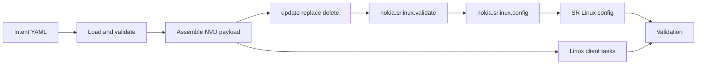
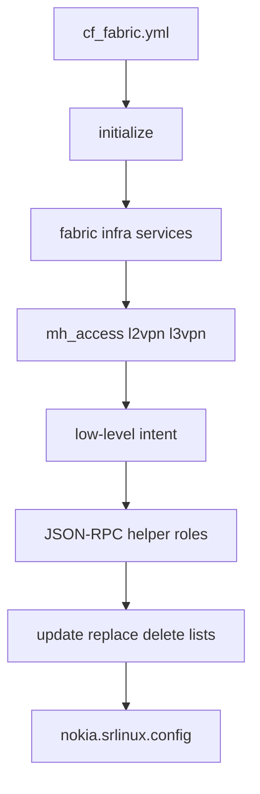
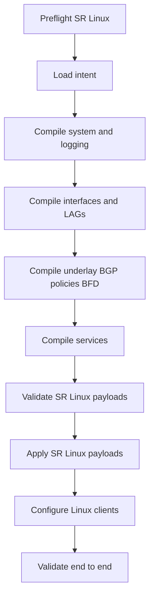
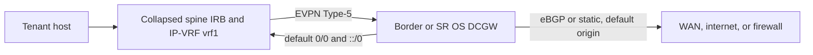

# Collapsed Spine NVD With Ansible - Plan Draft

Status: discussion draft. This is intentionally not a final implementation commitment yet.

Research date: 2026-06-06.

## Reference Policy

References are part of this plan and must be preserved as the plan evolves.

- Keep official documentation URLs with the relevant local conclusion.
- Keep local filesystem paths absolute so they are easy to reopen from this workspace.
- Keep temporary research clone paths and commit hashes for external repos.
- Keep current NVD source paths beside the design decisions they support.
- When implementation changes a decision, update the decision and its reference together.

## Goal

Add an Ansible-managed deployment path for the collapsed-spine NVD using the official Nokia SR Linux Ansible collection, `nokia.srlinux`.

The result should be a clean, maintainable, NVD-specific Ansible design that can configure the existing two collapsed spines, three ToRs, and six Linux endpoints without relying on SR Linux startup configs or EDA.

Target lab:

- SR Linux nodes: `spine1`, `spine2`, `tor1`, `tor2`, `tor3`.
- Linux endpoints: `s1`, `s2`, `s3`, `s4`, `s5`, `s6`.
- Use cases: L2 untagged, L2 tagged, L3 routed access, all-active EVPN multihoming, and single-active EVPN multihoming with LACP standby signaling.

## Recommendation

Create a new sibling variant:

`/Users/md/git/network/nokia/nokia-validated-designs/validated-designs/collapsed-spine/collapsed-spine-with-ansible`

Use the existing `collapsed-spine-with-eda` Containerlab topology as the starting point because it already omits SR Linux startup configs. Then move Linux endpoint setup from `exec` scripts into Ansible so the lab is genuinely Ansible-owned end to end.

For the automation model, use native Ansible: the inventory plus `group_vars`/`host_vars` are the intent, and a small filter plugin assembles the SR Linux payloads as data. Borrow vocabulary from the Ansible tutorial and the local EDA manifests, but do not copy the tutorial framework, its extra intent-directory layer, or its Jinja JSON templates; that solves a broader multi-fabric and multi-NOS problem than this NVD needs. See `Final Implementation Architecture (authoritative)` below.

Simplicity is a design requirement, not an aesthetic preference. This variant should feel like a small NVD-specific Ansible implementation, not a port of the tutorial framework. If a piece of code starts looking like a compiler, parser, generated sidecar, or generic fabric engine, it is the wrong shape for v1.

Recommended pattern:

1. Keep node-aware intent in `group_vars` (shared) and `host_vars` (per-node).
2. Assemble SR Linux JSON-RPC `update`, `replace`, and `delete` lists as native `{path, value}` data with the `srl_payload` filter (no Jinja).
3. Validate the change set with `nokia.srlinux.validate`.
4. Apply one transaction per SR Linux node with `nokia.srlinux.config`.
5. Configure Linux endpoints with normal Ansible Linux tasks.
6. Verify fabric and service state with `nokia.srlinux.get`, `nokia.srlinux.cli`, and endpoint pings.



## Final Implementation Architecture (authoritative)

This supersedes any separate intent-directory, transform-step, or Jinja-template framing inherited from the tutorial in the sections below. For a fixed 11-node NVD the idiomatic Ansible model is simplest, and is what we build:

- **The intent IS the Ansible data.** `inventory.yml` + `group_vars/` (shared) + `host_vars/` (per-node) hold everything. There is no separate intent directory and no runtime transform layer.
- **Vars stay readable.** They must describe hostnames, ports, LAGs, services, BGP, BFD, policies, endpoint VLANs, addresses, and routes in plain domain terms. They must not contain pre-rendered `update` / `replace` / `delete` blobs, raw payload sidecars, or generated resource inventories.
- **No Jinja JSON.** `nokia.srlinux.config` takes structured `{path, value}` dicts, not text. Payloads are assembled as native data by one small filter plugin, `filter_plugins/srl_payload.py`. There are no JSON-RPC helper roles and no `.j2` payload templates.
- **The filter is boring glue.** It maps readable vars to Nokia SR Linux paths. It must not parse `.cli`, load sidecar payload files, act as a generic compiler, or hide intent in opaque structures.
- **One `nokia.srlinux.config` transaction per SR Linux node** (`update` / `replace` / `delete`).
- **Linux endpoints** configured with normal Ansible modules.
- **No extractor-driven implementation.** The known-good `.cli` and `.sh` files are fidelity oracles. Any helper used to inspect them is test-only and disposable; it must not generate deployment vars or become part of the implementation path.

Data flow:

```text
group_vars/ + host_vars/  --(srl_config role + small srl_payload filter)-->  nokia.srlinux.config  -->  device
```

## Simplicity Guardrails

These are hard constraints for the implementation:

- Do not store rendered payloads in `group_vars` or `host_vars`.
- Do not keep `srl_resources`, `resource_inventory`, or similar payload-shaped sidecars as Ansible intent.
- Do not build or retain an `extract_intent.py`-driven workflow. The `.cli` and `.sh` files can be read by tests or humans, but deployable intent is hand-maintained readable Ansible vars.
- Keep `srl_payload.py` small, explicit, and NVD-specific. It should be a mapper from readable vars to `{path, value}`, not a parser or framework.
- Prefer explicit values over pools, schemas, graph preprocessing, and generic fabric abstractions for v1.
- Delete clever code before adding more clever code.

## Why Not A One-File Playbook

The official collection is intentionally generic. It exposes model-driven JSON-RPC operations for any SR Linux YANG path, but it does not include resource modules for EVPN fabrics, BGP overlays, MAC-VRFs, IRBs, Ethernet segments, LAGs, or NVD services.

That makes a raw one-file playbook unattractive:

- It would bury design intent inside long YANG payloads.
- It would duplicate repeated service and interface patterns.
- It would make changes to VLANs, VNIs, IRBs, and endpoints risky.
- It would not explain the relationship between the NVD and the resulting SR Linux config.

The right level of abstraction here is smaller than EDA but higher than raw JSON-RPC.

## Options To Discuss

Option A: Direct device payloads

- Store per-device `update` and `replace` payloads directly in host vars.
- Fastest implementation.
- Weakest abstraction and least reusable.
- Best only if the goal is a one-time replacement for CLI startup configs.

Option B: NVD-specific payload assembler, recommended

- Store topology, fabric, services, and clients as NVD-level intent.
- Assemble SR Linux payloads with small focused roles and templates.
- Best balance of readability, maintainability, and implementation effort.
- Easy to compare against the current CLI and EDA variants.

Option C: Adapt the full `intent-based-ansible-lab`

- Reuse the tutorial's broad role stack, schema validation, graph preprocessing, purge flow, and versioned templates.
- Most complete framework.
- Too broad for this NVD: classic Clos assumptions, leaf/spine roles, SROS support, purge behavior, and many resources we do not need.
- Best only if this repo wants a reusable automation framework across many future Nokia NVDs.

Recommended decision for implementation: Option B.

## Evidence From The Official SR Linux Collection

Official docs:

- `https://learn.srlinux.dev/ansible/collection/`
- `https://learn.srlinux.dev/ansible/collection/config/`
- `https://learn.srlinux.dev/ansible/collection/get/`
- `https://learn.srlinux.dev/ansible/collection/validate/`
- `https://learn.srlinux.dev/ansible/collection/cli/`

Official repo references:

- User-provided repository: `https://github.com/nokia/srlinux-ansible-integration`
- `galaxy.yml` in that repo points to repository metadata `https://github.com/nokia/srlinux-ansible-collection`
- Research clone: `/tmp/srlinux-ansible-integration`
- Refreshed origin/main: `f4ca5cebd9157edb23149691c00b4d464a006bdd`
- Refreshed origin/main date: `2025-12-23T18:51:52+01:00`
- Commit message: `Updated testing matrix and added ansible 2.18 and 2.19 (#36)`

Collection facts from the repo and docs:

- Collection namespace and name: `nokia.srlinux`
- Version in checked `galaxy.yml`: `1.1.0`
- Dependencies:
  - `ansible.netcommon >=5.2.0`
  - `ansible.utils >=3.0.0`
- Minimums documented by Learn SR Linux:
  - SR Linux `>=23.3.1`
  - Python `>=3.10`
- Connection model:
  - `ansible_connection: ansible.netcommon.httpapi`
  - `ansible_network_os: nokia.srlinux.srlinux`
  - JSON-RPC over HTTP or HTTPS
  - default lab credentials: `admin` / `NokiaSrl1!`
  - older SR Linux/Python combinations may need `ansible_httpapi_ciphers: ECDHE-RSA-AES256-SHA`
- Modules:
  - `nokia.srlinux.config`: model-driven configuration with `update`, `replace`, `delete`, `save_when`, `confirm_timeout`, check, and diff support.
  - `nokia.srlinux.get`: retrieve running or state data by YANG path.
  - `nokia.srlinux.validate`: validate an intended change set without committing it.
  - `nokia.srlinux.cli`: run show commands; useful for verification, not the primary config path.

Important local paths inspected:

- `/tmp/srlinux-ansible-integration/README.md`
- `/tmp/srlinux-ansible-integration/galaxy.yml`
- `/tmp/srlinux-ansible-integration/plugins/httpapi/srlinux.py`
- `/tmp/srlinux-ansible-integration/plugins/modules/config.py`
- `/tmp/srlinux-ansible-integration/plugins/modules/get.py`
- `/tmp/srlinux-ansible-integration/plugins/modules/validate.py`
- `/tmp/srlinux-ansible-integration/plugins/modules/cli.py`
- `/tmp/srlinux-ansible-integration/plugins/module_utils/srlinux.py`
- `/tmp/srlinux-ansible-integration/tests/hosts`
- `/tmp/srlinux-ansible-integration/tests/playbooks/set-interface.yml`
- `/tmp/srlinux-ansible-integration/tests/playbooks/set-multiple-paths.yml`
- `/tmp/srlinux-ansible-integration/tests/playbooks/set-confirm-timeout.yml`
- `/tmp/srlinux-ansible-integration/tests/playbooks/replace-full-cfg.yml`
- `/tmp/srlinux-ansible-integration/tests/playbooks/set-check.yml`
- `/tmp/srlinux-ansible-integration/tests/playbooks/validate.yml`

## How The Intent-Based Tutorial Assembles Things

Tutorial docs checked:

- `https://learn.srlinux.dev/tutorials/programmability/ansible/intent-based-management/`
- `https://learn.srlinux.dev/tutorials/programmability/ansible/intent-based-management/env/`
- `https://learn.srlinux.dev/tutorials/programmability/ansible/intent-based-management/project-structure/`
- `https://learn.srlinux.dev/tutorials/programmability/ansible/intent-based-management/config/`
- `https://learn.srlinux.dev/tutorials/programmability/ansible/intent-based-management/summary/`

Tutorial repo:

- `https://github.com/srl-labs/intent-based-ansible-lab`
- Research clone: `/tmp/intent-based-ansible-lab`
- Refreshed origin/main: `7ea5d8ac6ee1db59d343eca070a2f7dc66a8436a`
- Refreshed origin/main date: `2025-11-21T11:13:52+01:00`
- Commit message: `update fcli command in README`

Key assembly flow:



What happens in the tutorial:

1. `initialize` resets common `update`, `replace`, and `delete` lists, derives the intent directory, fetches running config, software version, and LLDP state, and asserts minimum SR Linux version.
2. `utils_load_intent` loads YAML, JSON, and Jinja-rendered intent files from an intent directory and merges them into role variables.
3. Level-2 roles map human intent into lower-level device intent:
   - `fabric` validates fabric intent, preprocesses topology with an action plugin, and renders low-level interface, BGP, policy, BFD, and network-instance intent.
   - `mh_access` maps multihoming intent to LAGs, member ports, and system Ethernet segments.
   - `l2vpn` maps bridge-domain service intent to MAC-VRFs, subinterfaces, and VXLAN interfaces.
   - `l3vpn` maps VRF and subnet intent to IP-VRFs, IRBs, routed VXLANs, and MAC-VRF IRB membership.
4. `infra` merges group-level and host-level low-level intent and validates against JSON schemas.
5. `configure` calls JSON-RPC helper roles. Each role renders SR Linux payload fragments and appends them to the shared `update`, `replace`, and `delete` lists.
6. One `nokia.srlinux.config` task applies the final transaction per node.
7. Optional purge uses the running config plus the full intent to generate delete operations.
8. Optional commit-confirm uses `confirm_timeout` and a second commit-confirm play.

Tutorial paths inspected:

- `/tmp/intent-based-ansible-lab/README.md`
- `/tmp/intent-based-ansible-lab/ansible.cfg`
- `/tmp/intent-based-ansible-lab/pyproject.toml`
- `/tmp/intent-based-ansible-lab/topo.clab.yml`
- `/tmp/intent-based-ansible-lab/inv/ansible-inventory.yml`
- `/tmp/intent-based-ansible-lab/inv/group_vars/srl.yml`
- `/tmp/intent-based-ansible-lab/playbooks/cf_fabric.yml`
- `/tmp/intent-based-ansible-lab/playbooks/roles/initialize/tasks/main.yml`
- `/tmp/intent-based-ansible-lab/playbooks/roles/utils_load_intent/tasks/main.yml`
- `/tmp/intent-based-ansible-lab/playbooks/roles/fabric/tasks/main.yml`
- `/tmp/intent-based-ansible-lab/playbooks/roles/fabric/action_plugins/process_fabric.py`
- `/tmp/intent-based-ansible-lab/playbooks/roles/fabric/templates/transform_fabric_intent.j2`
- `/tmp/intent-based-ansible-lab/playbooks/roles/fabric/criteria/fabric_intent.json`
- `/tmp/intent-based-ansible-lab/playbooks/roles/infra/tasks/main.yml`
- `/tmp/intent-based-ansible-lab/playbooks/roles/infra/filter_plugins/infra.py`
- `/tmp/intent-based-ansible-lab/playbooks/roles/infra/criteria/interfaces.json`
- `/tmp/intent-based-ansible-lab/playbooks/roles/infra/criteria/network_instance.json`
- `/tmp/intent-based-ansible-lab/playbooks/roles/infra/criteria/system.json`
- `/tmp/intent-based-ansible-lab/playbooks/roles/services/tasks/main.yml`
- `/tmp/intent-based-ansible-lab/playbooks/roles/mh_access/tasks/main.yml`
- `/tmp/intent-based-ansible-lab/playbooks/roles/mh_access/templates/transform_mh_access_intent.j2`
- `/tmp/intent-based-ansible-lab/playbooks/roles/mh_access/criteria/mh_access.json`
- `/tmp/intent-based-ansible-lab/playbooks/roles/l2vpn/tasks/main.yml`
- `/tmp/intent-based-ansible-lab/playbooks/roles/l2vpn/templates/transform_l2vpn_intent.j2`
- `/tmp/intent-based-ansible-lab/playbooks/roles/l2vpn/criteria/l2vpn.json`
- `/tmp/intent-based-ansible-lab/playbooks/roles/l3vpn/tasks/main.yml`
- `/tmp/intent-based-ansible-lab/playbooks/roles/l3vpn/templates/transform_l3vpn_intent.j2`
- `/tmp/intent-based-ansible-lab/playbooks/roles/l3vpn/criteria/l3vpn.json`
- `/tmp/intent-based-ansible-lab/playbooks/roles/configure/tasks/main.yml`
- `/tmp/intent-based-ansible-lab/playbooks/roles/<JSON-RPC-interface>/tasks/main.yml`
- `/tmp/intent-based-ansible-lab/playbooks/roles/<JSON-RPC-interface>/templates/srlinux/default/interface.j2`
- `/tmp/intent-based-ansible-lab/playbooks/roles/<JSON-RPC-interface>/templates/srlinux/default/subinterface.j2`
- `/tmp/intent-based-ansible-lab/playbooks/roles/<JSON-RPC-interface>/templates/srlinux/default/tunnel.j2`
- `/tmp/intent-based-ansible-lab/playbooks/roles/<JSON-RPC-network-instance>/tasks/main.yml`
- `/tmp/intent-based-ansible-lab/playbooks/roles/<JSON-RPC-network-instance>/templates/srlinux/default/networkinstance.j2`
- `/tmp/intent-based-ansible-lab/playbooks/roles/<JSON-RPC-system>/tasks/main.yml`
- `/tmp/intent-based-ansible-lab/playbooks/roles/<JSON-RPC-system>/templates/srlinux/default/system.j2`
- `/tmp/intent-based-ansible-lab/playbooks/roles/<JSON-RPC-bfd>/tasks/main.yml`
- `/tmp/intent-based-ansible-lab/playbooks/roles/<JSON-RPC-bfd>/templates/srlinux/default/bfd.j2`
- `/tmp/intent-based-ansible-lab/playbooks/roles/<JSON-RPC-policy>/tasks/main.yml`
- `/tmp/intent-based-ansible-lab/playbooks/roles/<JSON-RPC-policy>/templates/srlinux/default/policy.j2`
- `/tmp/intent-based-ansible-lab/playbooks/roles/<JSON-RPC-acl>/tasks/main.yml`
- `/tmp/intent-based-ansible-lab/playbooks/roles/utils_tpl_version/tasks/main.yml`
- `/tmp/intent-based-ansible-lab/intent_examples/infra/underlay_with_fabric_intent/fabric.yml`
- `/tmp/intent-based-ansible-lab/intent_examples/infra/underlay_with_fabric_intent/group_infra.yml`
- `/tmp/intent-based-ansible-lab/intent_examples/infra/underlay_with_fabric_intent/host_infra.yml`
- `/tmp/intent-based-ansible-lab/intent_examples/services/mh_access.yml`
- `/tmp/intent-based-ansible-lab/intent_examples/services/l2vpn_101.yml`
- `/tmp/intent-based-ansible-lab/intent_examples/services/l2vpn_102.yml`
- `/tmp/intent-based-ansible-lab/intent_examples/services/l3vpn_2001.yml`

What to borrow:

- The shared `update`, `replace`, `delete` transaction pattern.
- Role separation between payload assembly, apply, endpoint config, and validate.
- Use `nokia.srlinux.get` in preflight and post-checks.
- Use `confirm_timeout` as an optional lab safety feature.

What to simplify:

- No SROS support.
- No generic Clos graph engine for v1.
- No intent loading roles.
- No generated payload roles.
- No JSON schema framework unless a concrete bug proves it is needed.
- No implicit purge in v1.
- No broad versioned template lookup unless SR Linux 25.3.2 forces it.
- No support for arbitrary future resources before the current NVD is correct.

## EDA Vocabulary To Reuse As Inspiration

Local EDA manifests are a strong source of clean domain vocabulary, even though the implementation will not call EDA.

Useful local manifests:

- `/Users/md/git/network/nokia/nokia-validated-designs/validated-designs/collapsed-spine/collapsed-spine-with-eda/eda-manifests/fabric.yaml`
- `/Users/md/git/network/nokia/nokia-validated-designs/validated-designs/collapsed-spine/collapsed-spine-with-eda/eda-manifests/toponodes.yaml`
- `/Users/md/git/network/nokia/nokia-validated-designs/validated-designs/collapsed-spine/collapsed-spine-with-eda/eda-manifests/topolinks.yaml`
- `/Users/md/git/network/nokia/nokia-validated-designs/validated-designs/collapsed-spine/collapsed-spine-with-eda/eda-manifests/interfaces.yaml`
- `/Users/md/git/network/nokia/nokia-validated-designs/validated-designs/collapsed-spine/collapsed-spine-with-eda/eda-manifests/virtual-networks.yaml`
- `/Users/md/git/network/nokia/nokia-validated-designs/validated-designs/collapsed-spine/collapsed-spine-with-eda/eda-manifests/routed-interfaces.yaml`
- `/Users/md/git/network/nokia/nokia-validated-designs/validated-designs/collapsed-spine/collapsed-spine-with-eda/eda-manifests/collapsed-spine-asn.yaml`
- `/Users/md/git/network/nokia/nokia-validated-designs/validated-designs/collapsed-spine/collapsed-spine-with-eda/eda-manifests/system0-allocation.yaml`
- `/Users/md/git/network/nokia/nokia-validated-designs/validated-designs/collapsed-spine/collapsed-spine-with-eda/eda-manifests/tunnel-index-pool.yaml`
- `/Users/md/git/network/nokia/nokia-validated-designs/validated-designs/collapsed-spine/collapsed-spine-with-eda/eda-manifests/configlet-system-logging.yaml`
- `/Users/md/git/network/nokia/nokia-validated-designs/validated-designs/collapsed-spine/collapsed-spine-with-eda/eda-manifests/configlet-macvrf-arp.yaml`

External EDA docs checked:

- `https://docs.eda.dev/26.4/apps/fabrics.eda.nokia.com/docs/resources/fabric/`
- `https://docs.eda.dev/26.4/apps/services.eda.nokia.com/docs/`
- `https://docs.eda.dev/26.4/apps/services.eda.nokia.com/docs/resources/irbinterface/`
- `https://documentation.nokia.com/srlinux/25-7/books/interfaces/irb-interfaces-1.html`

EDA ideas worth borrowing:

- Model fabric nodes and links separately from services.
- Use pools for ASN, system0, and VXLAN tunnel indexes, even if the first implementation pins explicit values.
- Treat BridgeDomain, Router, IRBInterface, VLAN, and RoutedInterface as separate intent concepts.
- Keep selectors or attachments explicit so it is clear which node and interface gets which service.
- Keep configlets as explicit low-level exceptions only where the domain model is not worth extending.

One important fit point: the EDA Fabric docs explicitly discuss small networks where spine and borderleaf roles are collapsed. That matches this NVD: collapsed spines exchange underlay reachability and terminate EVPN services.

## Existing NVD Source Paths

Repository root:

- `/Users/md/git/network/nokia/nokia-validated-designs`

Current brainstorm doc:

- `/Users/md/git/network/nokia/nokia-validated-designs/validated-designs/collapsed-spine/ansible-collapsed-spine-brainstorm.md`

Without-EDA variant:

- `/Users/md/git/network/nokia/nokia-validated-designs/validated-designs/collapsed-spine/collapsed-spine-without-eda/README.md`
- `/Users/md/git/network/nokia/nokia-validated-designs/validated-designs/collapsed-spine/collapsed-spine-without-eda/2-way-collapsed-spine.clab.yaml`
- `/Users/md/git/network/nokia/nokia-validated-designs/validated-designs/collapsed-spine/collapsed-spine-without-eda/configs/spine1.cli`
- `/Users/md/git/network/nokia/nokia-validated-designs/validated-designs/collapsed-spine/collapsed-spine-without-eda/configs/spine2.cli`
- `/Users/md/git/network/nokia/nokia-validated-designs/validated-designs/collapsed-spine/collapsed-spine-without-eda/configs/tor1.cli`
- `/Users/md/git/network/nokia/nokia-validated-designs/validated-designs/collapsed-spine/collapsed-spine-without-eda/configs/tor2.cli`
- `/Users/md/git/network/nokia/nokia-validated-designs/validated-designs/collapsed-spine/collapsed-spine-without-eda/configs/tor3.cli`
- `/Users/md/git/network/nokia/nokia-validated-designs/validated-designs/collapsed-spine/collapsed-spine-without-eda/base-configs/s1.sh`
- `/Users/md/git/network/nokia/nokia-validated-designs/validated-designs/collapsed-spine/collapsed-spine-without-eda/base-configs/s2.sh`
- `/Users/md/git/network/nokia/nokia-validated-designs/validated-designs/collapsed-spine/collapsed-spine-without-eda/base-configs/s3.sh`
- `/Users/md/git/network/nokia/nokia-validated-designs/validated-designs/collapsed-spine/collapsed-spine-without-eda/base-configs/s4.sh`
- `/Users/md/git/network/nokia/nokia-validated-designs/validated-designs/collapsed-spine/collapsed-spine-without-eda/base-configs/s5.sh`
- `/Users/md/git/network/nokia/nokia-validated-designs/validated-designs/collapsed-spine/collapsed-spine-without-eda/base-configs/s6.sh`

With-EDA variant:

- `/Users/md/git/network/nokia/nokia-validated-designs/validated-designs/collapsed-spine/collapsed-spine-with-eda/README.md`
- `/Users/md/git/network/nokia/nokia-validated-designs/validated-designs/collapsed-spine/collapsed-spine-with-eda/2-way-collapsed-spine.clab.yaml`
- `/Users/md/git/network/nokia/nokia-validated-designs/validated-designs/collapsed-spine/collapsed-spine-with-eda/deploy-collapsed-spine-nvd.sh`
- `/Users/md/git/network/nokia/nokia-validated-designs/validated-designs/collapsed-spine/collapsed-spine-with-eda/destroy-collapsed-spine-nvd.sh`
- `/Users/md/git/network/nokia/nokia-validated-designs/validated-designs/collapsed-spine/collapsed-spine-with-eda/base-configs/s1.sh`
- `/Users/md/git/network/nokia/nokia-validated-designs/validated-designs/collapsed-spine/collapsed-spine-with-eda/base-configs/s2.sh`
- `/Users/md/git/network/nokia/nokia-validated-designs/validated-designs/collapsed-spine/collapsed-spine-with-eda/base-configs/s3.sh`
- `/Users/md/git/network/nokia/nokia-validated-designs/validated-designs/collapsed-spine/collapsed-spine-with-eda/base-configs/s4.sh`
- `/Users/md/git/network/nokia/nokia-validated-designs/validated-designs/collapsed-spine/collapsed-spine-with-eda/base-configs/s5.sh`
- `/Users/md/git/network/nokia/nokia-validated-designs/validated-designs/collapsed-spine/collapsed-spine-with-eda/base-configs/s6.sh`
- `/Users/md/git/network/nokia/nokia-validated-designs/validated-designs/collapsed-spine/collapsed-spine-with-eda/eda-manifests/namespace.yaml`
- `/Users/md/git/network/nokia/nokia-validated-designs/validated-designs/collapsed-spine/collapsed-spine-with-eda/eda-manifests/topology-view-collapsed.yaml`
- `/Users/md/git/network/nokia/nokia-validated-designs/validated-designs/collapsed-spine/collapsed-spine-with-eda/eda-manifests/init.yaml`
- `/Users/md/git/network/nokia/nokia-validated-designs/validated-designs/collapsed-spine/collapsed-spine-with-eda/eda-manifests/nodegroup.yaml`
- `/Users/md/git/network/nokia/nokia-validated-designs/validated-designs/collapsed-spine/collapsed-spine-with-eda/eda-manifests/nodeuser.yaml`
- `/Users/md/git/network/nokia/nokia-validated-designs/validated-designs/collapsed-spine/collapsed-spine-with-eda/eda-manifests/nodeprofile.yaml`
- `/Users/md/git/network/nokia/nokia-validated-designs/validated-designs/collapsed-spine/collapsed-spine-with-eda/eda-manifests/toponodes.yaml`
- `/Users/md/git/network/nokia/nokia-validated-designs/validated-designs/collapsed-spine/collapsed-spine-with-eda/eda-manifests/lag-admin-key-pool.yaml`
- `/Users/md/git/network/nokia/nokia-validated-designs/validated-designs/collapsed-spine/collapsed-spine-with-eda/eda-manifests/interfaces.yaml`
- `/Users/md/git/network/nokia/nokia-validated-designs/validated-designs/collapsed-spine/collapsed-spine-with-eda/eda-manifests/topolinks.yaml`
- `/Users/md/git/network/nokia/nokia-validated-designs/validated-designs/collapsed-spine/collapsed-spine-with-eda/eda-manifests/collapsed-spine-asn.yaml`
- `/Users/md/git/network/nokia/nokia-validated-designs/validated-designs/collapsed-spine/collapsed-spine-with-eda/eda-manifests/system0-allocation.yaml`
- `/Users/md/git/network/nokia/nokia-validated-designs/validated-designs/collapsed-spine/collapsed-spine-with-eda/eda-manifests/fabric.yaml`
- `/Users/md/git/network/nokia/nokia-validated-designs/validated-designs/collapsed-spine/collapsed-spine-with-eda/eda-manifests/irb-intf-pool.yaml`
- `/Users/md/git/network/nokia/nokia-validated-designs/validated-designs/collapsed-spine/collapsed-spine-with-eda/eda-manifests/tunnel-index-pool.yaml`
- `/Users/md/git/network/nokia/nokia-validated-designs/validated-designs/collapsed-spine/collapsed-spine-with-eda/eda-manifests/virtual-networks.yaml`
- `/Users/md/git/network/nokia/nokia-validated-designs/validated-designs/collapsed-spine/collapsed-spine-with-eda/eda-manifests/routed-interfaces.yaml`
- `/Users/md/git/network/nokia/nokia-validated-designs/validated-designs/collapsed-spine/collapsed-spine-with-eda/eda-manifests/configlet-system-logging.yaml`
- `/Users/md/git/network/nokia/nokia-validated-designs/validated-designs/collapsed-spine/collapsed-spine-with-eda/eda-manifests/configlet-macvrf-arp.yaml`

Existing Ansible pattern in this repo:

- `/Users/md/git/network/nokia/nokia-validated-designs/validated-designs/ai-dc/two-stripe-rail-optimized/ansible/ansible.cfg`
- `/Users/md/git/network/nokia/nokia-validated-designs/validated-designs/ai-dc/two-stripe-rail-optimized/ansible/inventory.yml`
- `/Users/md/git/network/nokia/nokia-validated-designs/validated-designs/ai-dc/two-stripe-rail-optimized/ansible/playbook.yml`
- `/Users/md/git/network/nokia/nokia-validated-designs/validated-designs/ai-dc/two-stripe-rail-optimized/ansible/group_vars/stripe1.yml`
- `/Users/md/git/network/nokia/nokia-validated-designs/validated-designs/ai-dc/two-stripe-rail-optimized/ansible/group_vars/stripe2.yml`
- `/Users/md/git/network/nokia/nokia-validated-designs/validated-designs/ai-dc/two-stripe-rail-optimized/ansible/host_vars/s1.yml`
- `/Users/md/git/network/nokia/nokia-validated-designs/validated-designs/ai-dc/two-stripe-rail-optimized/ansible/host_vars/s2.yml`
- `/Users/md/git/network/nokia/nokia-validated-designs/validated-designs/ai-dc/two-stripe-rail-optimized/ansible/host_vars/s3.yml`
- `/Users/md/git/network/nokia/nokia-validated-designs/validated-designs/ai-dc/two-stripe-rail-optimized/ansible/host_vars/s4.yml`

## Current Target Configuration Summary

The current without-EDA variant has 1145 lines of SR Linux CLI startup config:

- `spine1.cli`: 489 lines
- `spine2.cli`: 489 lines
- `tor1.cli`: 57 lines
- `tor2.cli`: 55 lines
- `tor3.cli`: 55 lines

Spine target:

- Hostnames:
  - `spine1` -> `d3l-29-spine1`
  - `spine2` -> `d3l-30-spine2`
- System IPs:
  - `spine1`: `192.0.2.2/32`
  - `spine2`: `192.0.2.1/32`
- ASNs:
  - `spine1`: `65501`
  - `spine2`: `65502`
- Inter-spine links:
  - `ethernet-1/31.0`
  - `ethernet-1/32.0`
  - IPv6 RA enabled for BGP unnumbered.
  - BFD enabled.
- Default network-instance:
  - `receive-ipv4-check false`
  - BGP dynamic neighbors on `ethernet-1/31.0` and `ethernet-1/32.0`
  - IPv4, IPv6, and EVPN AFI-SAFI enabled.
  - EVPN inter-AS VPN enabled.
  - Import and export routing policies for ISL eBGP.
- EVPN multihoming Ethernet segments:
  - `spine1-spine2-tor1-lag`, all-active, `lag1`
  - `spine1-spine2-tor2-lag`, all-active, `lag2`
  - `spine1-spine2-tor3-lag`, all-active, `lag3`
  - `spine1-spine2-tor4-lag`, single-active, `lag4`, standby signaling and preference election
- LAGs:
  - `lag1`: VLAN 50, to `tor1`
  - `lag2`: untagged VLAN 10, to `tor2`
  - `lag3`: VLAN 70, to `tor3`
  - `lag4`: VLAN 40 plus untagged VLAN 10, to dual-homed host `s3`
- Direct host access:
  - `spine1 ethernet-1/27`: untagged VLAN 10, tagged VLAN 20, routed VLAN 100
  - `spine2 ethernet-1/29`: tagged VLAN 10, tagged VLAN 30, routed VLAN 100
- EVPN VXLAN MAC-VRFs:
  - `macvrf-v10`, VNI `10010`, EVI `10`, RT `1:10`
  - `macvrf-v20`, VNI `10020`, EVI `20`, RT `1:20`
  - `macvrf-v30`, VNI `10030`, EVI `30`, RT `1:30`
  - `macvrf-v40`, VNI `10040`, EVI `40`, RT `1:40`
  - `macvrf-v50`, VNI `10050`, EVI `50`, RT `1:50`
  - `macvrf-v70`, VNI `10070`, EVI `70`, RT `1:70`
- IP-VRF:
  - `vrf1`, VNI `10500`, EVI `500`, RT `1:500`
- IRB subinterfaces:
  - `irb0.0` for VLAN 30
  - `irb0.1` for VLAN 70
  - `irb0.2` for VLAN 50
  - `irb0.3` for VLAN 20
  - `irb0.4` for VLAN 10
  - `irb0.5` for VLAN 40
  - IPv4 and IPv6 anycast gateway behavior.

ToR target:

- `tor1`: LAG to spines plus local `ethernet-1/55.50`, simple MAC-VRF `v50-simple`.
- `tor2`: LAG to spines plus local untagged `ethernet-1/56.4096`, simple MAC-VRF `v10-simple`.
- `tor3`: LAG to spines plus local `ethernet-1/32.70`, simple MAC-VRF `v70-simple`.
- ToRs do not run underlay or EVPN overlay in the current target. They are simple access switches for this NVD.

Linux endpoint target:

- `s1`: `eth1`, `eth1.20`, `eth1.100`; IPv4 and IPv6 routes for VLANs 10, 20, 100.
- `s2`: `eth1.10`, `eth1.30`, `eth1.100`; IPv4 and IPv6 routes for VLANs 10, 30, 100.
- `s3`: `bond0` in 802.3ad mode with `eth1` and `eth2`; untagged VLAN 10 and tagged VLAN 40.
- `s4`: `eth1.50`.
- `s5`: untagged `eth1` for VLAN 10.
- `s6`: `eth1.70`.

## Containerlab Findings

Containerlab docs repo:

- `/Users/md/git/network/containerlabs/containerlab-md`
- Commit inspected: `300ec999559285a22fe783ea330cf212ade2cb2b`
- Commit date: `2026-06-04T23:07:27+02:00`
- Commit message: `Removing note on SRL documentation (#3216)`

Relevant paths:

- `/Users/md/git/network/containerlabs/containerlab-md/docs/manual/inventory.md`
- `/Users/md/git/network/containerlabs/containerlab-md/docs/manual/kinds/srl.md`
- `/Users/md/git/network/containerlabs/containerlab-md/lab-examples/clos02/README.md`
- `/Users/md/git/network/containerlabs/containerlab-md/lab-examples/clos02/clos02.clab.yml`
- `/Users/md/git/network/containerlabs/containerlab-md/lab-examples/clos02/setup.clos02.clab.yml`

Findings:

- Containerlab auto-generates `ansible-inventory.yml` for deployed labs.
- SR Linux nodes in generated inventory get `ansible_network_os: nokia.srlinux.srlinux` and `ansible_connection: ansible.netcommon.httpapi`.
- Containerlab can add custom Ansible groups with the `ansible-group` label.
- Default SR Linux lab credentials are `admin:NokiaSrl1!`.
- SR Linux Containerlab nodes expose JSON-RPC, which is what the collection uses.

Recommended inventory decision:

- Keep a source-controlled static inventory in the Ansible directory for clarity and stable group vars.
- Optionally add Containerlab `ansible-group` labels so generated inventory remains useful for ad hoc runs.

VRNetLab repo:

- `/Users/md/git/network/containerlabs/vrnetlab-containerlab`
- Commit inspected: `a217680ce408ac3ffdbdab7735d74526a7735154`
- Commit date: `2026-04-17T20:04:23+02:00`
- Commit message: `custom Juniper Apstra make folder (#456)`

Finding:

- Not directly useful for this SR Linux container use case. SR Linux is a native Containerlab kind, not a vrnetlab VM path here.

## Proposed Directory Layout

```text
validated-designs/collapsed-spine/collapsed-spine-with-ansible/
  README.md
  2-way-collapsed-spine.clab.yaml
  requirements.yml
  tools/
    check_fidelity.py          # optional test helper: compare intended resources against known-good .cli/.sh
  ansible/
    ansible.cfg
    inventory.yml              # groups: collapsed_spines, tors (under srl); linux_clients
    group_vars/
      all.yml                  # fabric-wide constants: logging, mac-dup, mac-aging, BFD, EVPN/BGP afi-safi, policies, prefix-set
      collapsed_spines.yml     # shared spine underlay/overlay + the service CATALOG (per-bd vni/evi/rt/irb addrs, vrf1)
      tors.yml                 # shared ToR settings (simple mac-vrf defaults)
      linux_clients.yml
    host_vars/
      spine1.yml spine2.yml    # per-node: hostname, asn, system_ipv4, df_preference, WHICH bds/IRBs/LAGs/L3-ports live here
      tor1.yml tor2.yml tor3.yml
      s1.yml s2.yml s3.yml s4.yml s5.yml s6.yml
    filter_plugins/
      srl_payload.py           # builds update/replace/delete lists as native data from the vars (NO Jinja)
    playbooks/
      deploy.yml               # preflight -> assemble payload -> validate -> apply -> linux -> verify
      validate.yml             # state + connectivity checks only
    roles/
      srl_config/              # uses srl_payload filter; one nokia.srlinux.config transaction per node
      linux_endpoint/          # VLANs, bonds, addresses, routes on s1..s6
      srl_validate/            # nokia.srlinux.get + nokia.srlinux.cli + endpoint pings
```

The split rule: a value that is identical on both spines lives in `group_vars/collapsed_spines.yml` (the service catalog, BGP knobs, BFD); a value that differs per node lives in `host_vars/<node>.yml` (ASN, system IP, DF preference, the list of which catalog services/IRBs/LAGs are present, the LAG member ports, the L3 routed port). This is exactly where the per-spine asymmetries are pinned.

## Proposed Playbook Flow

`playbooks/deploy.yml`:



Role responsibilities (three roles, no extra intent layer):

- `srl_config` (runs on `srl` hosts)
  - Preflight: fetch `/system/information/version`, assert it is compatible with the collection.
  - Build `update` / `replace` / `delete` lists by calling the `srl_payload` filter on the host's vars. The filter covers, per node: hostname + logging + LLDP; physical interfaces, LAGs and member ports, subinterfaces, system0, tunnel-interface VXLAN entries; routing policies, default network-instance, eBGP unnumbered dynamic neighbors, IPv4/IPv6/EVPN AFI-SAFI; BFD on inter-spine links; system EVPN/BGP-VPN and Ethernet segments; spine MAC-VRFs, IP-VRF `vrf1`, IRBs and routed service interfaces; simple ToR MAC-VRFs.
  - Optionally run `nokia.srlinux.validate` on the assembled change set.
  - Apply one `nokia.srlinux.config` transaction. `save_when` and optional `confirm_timeout` controlled by extra vars.
- `linux_endpoint` (runs on `linux_clients`)
  - Configure VLANs, bonds, addresses, and routes on `s1` through `s6`.
- `srl_validate`
  - `nokia.srlinux.get` + `nokia.srlinux.cli` for state; endpoint pings for connectivity.

## Intent Model Sketch

This schema is derived bottom-up from the working `spine1.cli`, `spine2.cli`, and `tor*.cli`, not hand-modeled from EDA. Every value below is traceable to a line in those files. v1 pins explicit values; pools are deferred.

> Status: the per-node data shown below is the intended Ansible data model. It lives directly as readable `group_vars` and `host_vars`, not as a separate `intent/` directory and not as generated payload inventory. Fidelity is checked by comparing the filter-built payload and endpoint commands against the known-good `.cli` / `.sh` oracle.

### Asymmetries that MUST be preserved (do not flatten)

The two collapsed spines are not mirror images. A flat, symmetric model will deploy the wrong config. The model is node-aware specifically to capture these:

1. `macvrf-v20` (VLAN 20) exists on **spine1 only**; `macvrf-v30` (VLAN 30) exists on **spine2 only**.
2. IRB subinterface indices differ: spine1 uses `irb0.1..5`; spine2 uses `irb0.0,1,2,4,5`. The index is a property of the bridge domain (v20=irb0.3 on spine1, v30=irb0.0 on spine2), not a global counter.
3. The `tor4` single-active Ethernet segment DF `preference-value` is **800 on spine1** but **500 on spine2** (spine1 is the preferred DF).
4. The `lag3` (to tor3) spine member port is `ethernet-1/29` on spine1 but `ethernet-1/30` on spine2, because `ethernet-1/29` is consumed by host access on spine2.
5. The L3 routed access port differs: `ethernet-1/27.100` on spine1 (`172.16.100.2/31`) vs `ethernet-1/29.100` on spine2 (`172.16.100.0/31`); both land in `vrf1`.
6. The VLAN 10 access encap differs: untagged on spine1 (`ethernet-1/27.4096`) vs tagged on spine2 (`ethernet-1/29.10`).
7. LAG id is per-device: the spine-side LAG to a ToR is `lag1/lag2/lag3`, but on every ToR its uplink is locally `lag1`.

`fabric.yml`:

```yaml
fabric:
  name: dc1-collapsed-spine
  # v1 pins explicit values; asn_pool/system_pool are future work, not used yet.
  underlay:
    protocol: ebgp
    unnumbered: ipv6              # IPv6 RA router-role on inter-spine links
    receive_ipv4_check: false
    bfd: { enabled: true, detection_multiplier: 3,
           desired_min_tx_interval: 1000000, required_min_rx_interval: 1000000 }
  overlay: { protocol: ebgp, afi_safi: [evpn, ipv4-unicast, ipv6-unicast], inter_as_vpn: true }
  nodes:
    spine1: { role: collapsed_spine, hostname: d3l-29-spine1, system_ipv4: 192.0.2.2/32, asn: 65501 }
    spine2: { role: collapsed_spine, hostname: d3l-30-spine2, system_ipv4: 192.0.2.1/32, asn: 65502 }
    tor1:   { role: tor, hostname: d2l-34-tor1 }
    tor2:   { role: tor, hostname: d2l-35-tor2 }
    tor3:   { role: tor, hostname: d3l-28-tor3 }
  inter_spine_links:             # both ISLs, BGP-unnumbered + BFD, dynamic neighbors
    - { sub: ethernet-1/31.0 }
    - { sub: ethernet-1/32.0 }
```

`interfaces.yml` (node-aware spine members; ToR-local lag id):

```yaml
lags:
  spine1-spine2-tor1-lag:
    es: { esi: "00:00:00:00:00:00:12:00:00:00", mode: all-active }
    spine_lag_id: lag1
    spine_members: { spine1: [ethernet-1/25], spine2: [ethernet-1/25] }
    tor: { node: tor1, lag_id: lag1, members: [ethernet-1/51, ethernet-1/52] }
    access: [{ vlan: 50, encap: tagged, bridge_domain: macvrf-v50 }]
  spine1-spine2-tor2-lag:
    es: { esi: "00:00:00:00:00:12:00:00:00:00", mode: all-active }
    spine_lag_id: lag2
    spine_members: { spine1: [ethernet-1/26], spine2: [ethernet-1/26] }
    tor: { node: tor2, lag_id: lag1, members: [ethernet-1/51, ethernet-1/52] }
    access: [{ vlan: 10, encap: untagged, bridge_domain: macvrf-v10 }]
  spine1-spine2-tor3-lag:
    es: { esi: "00:00:00:00:12:00:00:00:00:00", mode: all-active }
    spine_lag_id: lag3
    spine_members: { spine1: [ethernet-1/29], spine2: [ethernet-1/30] }   # asymmetry #4
    tor: { node: tor3, lag_id: lag1, members: [ethernet-1/29, ethernet-1/30] }
    access: [{ vlan: 70, encap: tagged, bridge_domain: macvrf-v70 }]
  spine1-spine2-tor4-lag:        # no tor4 node: this LAG is the dual-homed host s3
    es:
      esi: "00:00:00:12:00:00:00:00:00:00"
      mode: single-active
      standby_signaling: lacp
      df_preference: { spine1: 800, spine2: 500 }   # asymmetry #3
      non_revertive: true
    spine_lag_id: lag4
    spine_members: { spine1: [ethernet-1/23], spine2: [ethernet-1/23] }
    access:
      - { vlan: 40, encap: tagged,   bridge_domain: macvrf-v40 }
      - { vlan: 10, encap: untagged, bridge_domain: macvrf-v10 }
```

`services.yml` (node-aware; explicit vxlan index; L3 routed access):

```yaml
routers:
  vrf1:
    type: evpn-vxlan
    vxlan_index: 506            # was missing entirely from the old sketch
    vni: 10500
    evi: 500
    route_target: "1:500"
    nodes: [spine1, spine2]

bridge_domains:                 # tunnel index, evi, rt all per-real-config
  macvrf-v10: { vlan: 10, vxlan_index: 504, vni: 10010, evi: 10, route_target: "1:10",
                nodes: [spine1, spine2], irb: { index: 4, ipv4: 172.16.10.254/24, ipv6: 2001:db8:0:10::254/64, arp_timeout: 250 } }
  macvrf-v20: { vlan: 20, vxlan_index: 503, vni: 10020, evi: 20, route_target: "1:20",
                nodes: [spine1], irb: { index: 3, ipv4: 172.16.20.254/24, ipv6: 2001:db8:0:20::254/64, arp_timeout: 14400 } }   # spine1 only
  macvrf-v30: { vlan: 30, vxlan_index: 500, vni: 10030, evi: 30, route_target: "1:30",
                nodes: [spine2], irb: { index: 0, ipv4: 172.16.30.254/24, ipv6: 2001:db8:0:30::254/64, arp_timeout: 14400 } }   # spine2 only
  macvrf-v40: { vlan: 40, vxlan_index: 505, vni: 10040, evi: 40, route_target: "1:40",
                nodes: [spine1, spine2], irb: { index: 5, ipv4: 172.16.40.254/24, ipv6: 2001:db8:0:40::254/64, arp_timeout: 14400 } }
  macvrf-v50: { vlan: 50, vxlan_index: 502, vni: 10050, evi: 50, route_target: "1:50",
                nodes: [spine1, spine2], irb: { index: 2, ipv4: 172.16.50.254/24, ipv6: 2001:db8:0:50::254/64, arp_timeout: 14400 } }
  macvrf-v70: { vlan: 70, vxlan_index: 501, vni: 10070, evi: 70, route_target: "1:70",
                nodes: [spine1, spine2], irb: { index: 1, ipv4: 172.16.70.254/24, ipv6: 2001:db8:0:70::254/64, arp_timeout: 14400 } }

l3_access:                      # the routed VLAN-100 use case, missing from old sketch
  - { node: spine1, port: ethernet-1/27, sub: 100, vrf: vrf1, ipv4: 172.16.100.2/31, ipv6: 2001:db8:0:100::2/127 }
  - { node: spine2, port: ethernet-1/29, sub: 100, vrf: vrf1, ipv4: 172.16.100.0/31, ipv6: 2001:db8:0:100::/127 }

tor_simple_services:            # local mac-vrf on the ToRs, no EVPN/overlay
  v50-simple: { node: tor1, attachments: [{ port: ethernet-1/55, vlan: 50, encap: tagged }, { port: lag1, vlan: 50, encap: tagged }] }
  v10-simple: { node: tor2, attachments: [{ port: ethernet-1/56, vlan: 10, encap: untagged }, { port: lag1, vlan: 10, encap: untagged }] }
  v70-simple: { node: tor3, attachments: [{ port: ethernet-1/32, vlan: 70, encap: tagged }, { port: lag1, vlan: 70, encap: tagged }] }
```

`clients.yml` (unchanged shape; addresses verified against `base-configs/s3.sh`):

```yaml
clients:
  s3:
    bonds: { bond0: { mode: 802.3ad, members: [eth1, eth2] } }
    interfaces:
      bond0:    { ipv4: [172.16.10.3/24], ipv6: [2001:db8:0:10::3/64] }    # untagged VLAN 10
      bond0.40: { vlan: 40, ipv4: [172.16.40.3/24], ipv6: [2001:db8:0:40::3/64] }
```

## JSON-RPC Payload Strategy

Payloads are built as **native data structures** by `filter_plugins/srl_payload.py` and handed to `nokia.srlinux.config` as `update` / `replace` / `delete` lists of `{path, value}`. No Jinja, no text-templated JSON. The filter is plain Python and is unit-testable offline by comparing its output to the known-good `.cli` files and the endpoint vars to the known-good `.sh` scripts.

Use clear rules for operation type:

- `update` for containers where we only set a few leaves and do not want to replace unrelated generated defaults.
- `replace` for complete owned resources such as:
  - `/interface[name=lag1]`
  - `/interface[name=ethernet-1/27]/subinterface[index=20]`
  - `/network-instance[name=macvrf-v10]`
  - `/network-instance[name=vrf1]`
  - `/tunnel-interface[name=vxlan0]/vxlan-interface[index=500]`
- `delete` only for explicit `_state: deleted` resources in v1.

Defer implicit purge:

- Starting from no SR Linux startup config means no purge is required for the happy path.
- Implicit purge is powerful but dangerous if the lab later contains manual state or Containerlab default state we do not model.
- Add purge only after the base deployment is verified and the managed resource scope is explicit.

## Validation Plan

Preflight:

- `ansible-galaxy collection install -r requirements.yml`
- `ansible-inventory -i ansible/inventory.yml --graph`
- `ansible-playbook -i ansible/inventory.yml ansible/playbooks/deploy.yml --check --diff`
- `python3 tools/check_fidelity.py` if present (assert readable vars plus filter-built payloads still match the known-good `.cli` / `.sh` oracle)

SR Linux validation with modules:

- `nokia.srlinux.get`:
  - `/system/information/version`
  - `/system/name/host-name`
  - `/interface[name=*]`
  - `/network-instance[name=*]`
  - `/system/network-instance/protocols/evpn`
  - `/bfd`
- `nokia.srlinux.cli` for human-readable checks:
  - `show network-instance summary`
  - `show interface lag*`
  - `show lag`
  - `show system network-instance protocols evpn ethernet-segments`
  - `show network-instance default protocols bgp neighbor`
  - `show network-instance default protocols bgp routes evpn`
  - `show tunnel-interface vxlan0`

Linux endpoint validation:

- `ip -br link`
- `ip -br addr`
- `ip route show table all`
- `ping` and `ping6` between expected same-VLAN endpoints.
- Routed reachability through `vrf1` gateways.
- Bond state on `s3`.

Regression comparison:

- Compare rendered intent-derived resource inventory against the current CLI resource list:
  - number of interfaces and subinterfaces
  - LAG definitions
  - Ethernet segment names and modes
  - MAC-VRF and IP-VRF names
  - EVPN EVI/VNI/RT mapping
  - routed interfaces and IRB addresses

## Implementation Phases

Phase 0: finalize design decisions

- Confirm Option B.
- Confirm whether the Ansible variant should be a new sibling directory or replace/extend without-EDA.
- Confirm whether Linux endpoints must be 100 percent Ansible-configured in v1.
- Confirm whether startup configs are completely removed for SR Linux in the Ansible variant.

Phase 1: scaffold the variant

- Copy the `collapsed-spine-with-eda` topology as a base.
- Remove or disable Linux endpoint `exec` scripts if full Ansible ownership is confirmed.
- Add Ansible labels to nodes or keep a static inventory only.
- Add `requirements.yml`, `ansible.cfg`, and `inventory.yml`.

Phase 2: encode intent

- Convert local EDA manifests and CLI configs into `fabric.yml`, `interfaces.yml`, `services.yml`, and `clients.yml`.
- Keep explicit values in v1 rather than over-automating allocation pools.
- Add JSON schemas for top-level sanity checks.

Phase 3: assemble and apply infrastructure

- Hostnames, logging, LLDP.
- Physical interfaces, system0, inter-spine subinterfaces.
- Routing policies, BGP, and BFD.
- Validate spine underlay first.

Phase 4: assemble and apply access and multihoming

- LAGs on spines and ToRs.
- EVPN Ethernet segments.
- Single-active LAG behavior and standby signaling.
- Verify LACP and Ethernet segment state before services.

Phase 5: assemble and apply services

- ToR simple MAC-VRFs.
- Spine MAC-VRFs.
- IP-VRF `vrf1`.
- VXLAN tunnel interfaces.
- IRB and routed service interfaces.

Phase 6: Linux endpoint automation

- Replace shell startup scripts with Ansible tasks.
- Configure VLANs, bonds, addresses, and routes.
- Make tasks idempotent enough for repeated playbook runs in containers.

Phase 7: validation and docs

- Add `validate.yml`.
- Add README instructions:
  - deploy lab
  - install Ansible collections
  - run check/diff
  - run deploy
  - run validation
  - teardown
- Add troubleshooting notes for JSON-RPC, inventory, and commit-confirm.

## Future Iteration: SR OS And Internet/WAN Breakout

This is a second-iteration (v2) section. It is intentionally out of scope for v1. v1 is SR Linux only, EVPN-VXLAN inside the lab, no north-south breakout. This section records what we now understand about the topic and what would have to be added later so the v1 design does not paint us into a corner.

### Scope boundary for v1

- v1 manages only the five SR Linux nodes plus the six Linux endpoints with `nokia.srlinux`.
- v1 has no default route to the outside world. Tenant IP-VRF `vrf1` is reachable only inside the fabric.
- v1 deliberately drops the tutorial's `sros`, `dcgw`, `borderleaf`, and `superspine` constructs. See `What to simplify` above (`No SROS support`).

The reason to write this section now: the v1 intent model and role layout must leave clean seams for a vendor dimension and an external/border service, even though we do not build them yet.

### Understanding the topic: SR Linux vs SR OS automation

SR OS is a different NOS from SR Linux, and its Ansible story is fundamentally different. This is the single most important thing to understand before assuming SR OS is a small add-on.

| Aspect | SR Linux (`nokia.srlinux`) | SR OS (`nokia.sros`) |
| --- | --- | --- |
| Collection | `nokia.srlinux` v1.1.0 | `nokia.sros` (from `nokia/ansible-networking-collections`) |
| Connection | `ansible.netcommon.httpapi`, JSON-RPC | `ansible.netcommon.network_cli` / `netconf` |
| `network_os` | `nokia.srlinux.srlinux` | `nokia.sros.classic`, `nokia.sros.md`, or `nokia.sros.light` |
| Config model | Model-driven `config` with `update`/`replace`/`delete` | Generic `ansible.netcommon.cli_config` / `cli_command`; CLI text, not a YANG path tree |
| Pre-commit check | `nokia.srlinux.validate` module | No equivalent module; classic mode uses rollback-on-error, MD-CLI uses candidate/commit |
| State read | `nokia.srlinux.get` by YANG path | `nokia.sros.device_info` plus show commands |
| Transaction | One JSON-RPC transaction per node | Rollback checkpoint (classic) or candidate datastore commit (md-cli) |

Consequence: SR OS is not a fourth template under the existing roles only. It is a second connection model, a second validation strategy, a second credential set, and a second template language. The intent-based tutorial already proves this split: each JSON-RPC helper role ships both `templates/srlinux/default/` and `templates/sros/default/`, and `utils_tpl_version` selects the vendor and version directory at render time.

### What internet/WAN breakout actually requires

Breakout means giving tenant subnets a path to the outside world. In a collapsed-spine EVPN fabric there are two shapes:

- Shape 1, breakout on the collapsed spines themselves. SR Linux can do this with no new node. Add an external/WAN VRF or use the global routing table, originate a default route into IP-VRF `vrf1` via EVPN Type-5 IP-prefix routes, add an uplink subinterface to an upstream router or firewall, and run eBGP or static toward the upstream. Cheapest, still all SR Linux, still `nokia.srlinux`.
- Shape 2, a dedicated SR OS border/DC gateway. Add an SR OS node (the tutorial `dcgw`, the EDA collapsed `borderleaf` role) that terminates EVPN-VXLAN and hands the tenant IP-VRF off to MPLS L3VPN or the internet. This is the realistic WAN-edge/PE pattern and the only one that actually needs `nokia.sros`.

Either way, the new routing behavior is the same set of building blocks:

- A border function that terminates EVPN IP-VRF `vrf1` and bridges it to an external context.
- Default-route origination (`0.0.0.0/0` and `::/0`) into the EVPN IP-VRF so tenants inherit a path north.
- An external-facing interface and an upstream peering (eBGP or static) to a WAN router, internet edge, or firewall.
- Import/export route policies and, for true internet, NAT or a firewall handoff and likely a separate internet VRF.
- Optionally an all-active Ethernet segment / LAG toward the upstream for redundancy.



### What the findings tell us to add later

Grounded in the repos we inspected, a v2 that adds SR OS breakout would re-introduce exactly what v1 simplifies away, plus a real routing design:

1. Inventory and connection. Add a `border` or `dcgw` group with `ansible_network_os: nokia.sros.classic` (or `.md`), `ansible_connection: ansible.netcommon.network_cli`, and its own credentials. Add `nokia.sros` to `requirements.yml`.
2. Vendor dimension in intent. Give each node a `nos` and optional `version`, defaulting to `srlinux`. This is the seam v1 must leave open even though every v1 node is `srlinux`.
3. Vendored templates. Mirror the tutorial: `roles/.../templates/<vendor>/<version>/...` and a small version/vendor lookup, instead of v1's single `srlinux/default` path. Only build the `sros` tree when v2 starts.
4. A border assembly role and a border apply role. For example `nvd_assemble_border` for the external VRF, default origination, and upstream peering, and `nvd_apply_sros` because the SR OS apply and validate path is not the `nokia.srlinux.config` plus `validate` flow. Validation in `nvd_validate` must branch by vendor: model-driven `get` for SR Linux, `device_info` plus show parsing for SR OS.
5. A `border` / `wan` intent block. Upstream neighbors, default origination toggle, internet VRF, NAT pools, and route policies, kept separate from the in-fabric `services.yml`.
6. Transaction-model branching. SR Linux stays one JSON-RPC transaction. SR OS uses rollback-on-error (classic) or candidate/commit (md-cli). The apply layer must not assume the SR Linux transaction shape.

### Why v1 stays clean for this

- v1 keeps fabric nodes, links, and services as separate intent concepts, so a border node and a `wan` service slot in without reworking the model.
- v1 pins the per-node assembly roles (`nvd_assemble_*`) so a `nvd_assemble_border` and `nvd_apply_sros` are additive, not a rewrite.
- v1 uses a static inventory with explicit groups, so adding a `border`/`dcgw` group with a different connection profile is a local change.
- v1 already separates IP-VRF `vrf1` from the bridge domains, which is the exact object a future default route and EVPN Type-5 handoff attach to.

### Open questions for v2 (do not answer in v1)

1. Breakout Shape 1 (on the collapsed spines, all SR Linux) or Shape 2 (dedicated SR OS DCGW)?
2. If SR OS, classic CLI with rollback, or MD-CLI with candidate/commit?
3. Internet (NAT plus firewall) or WAN handoff to MPLS L3VPN, or both as separate profiles?
4. Does the border attach to the existing IP-VRF `vrf1` only, or to a new dedicated internet VRF with controlled route leaking?
5. Is the upstream single-homed or multihomed with an Ethernet segment / LAG?

## Risks And Mitigations

Risk: SR Linux YANG payloads are verbose and easy to get subtly wrong.

- Mitigation: start from current CLI target, validate each payload with `nokia.srlinux.validate`, and phase by resource group.

Risk: Tutorial templates do not cover every current NVD CLI leaf.

- Mitigation: write NVD-owned templates only for required features; borrow patterns, not code wholesale.

Risk: Implicit purge deletes more than intended.

- Mitigation: no implicit purge in v1; only explicit deletes.

Risk: Linux endpoint commands are not fully idempotent.

- Mitigation: use Ansible checks before creating VLANs/bonds/routes, or accept container-lab-only reset behavior and document it.

Risk: Generated Containerlab inventory names can surprise users.

- Mitigation: ship a static inventory with explicit `ansible_host` values and use Containerlab generated inventory only as optional convenience.

Risk: Config drift between CLI, EDA, and Ansible variants.

- Mitigation: list target resources in intent and include validation that asserts key names, IDs, VNIs, EVIs, ASNs, route targets, and addresses.

## Brainstorm Questions Before We Commit

1. Should `collapsed-spine-with-ansible` be a new sibling variant, or should it replace the current `collapsed-spine-without-eda` workflow?
2. Do we want Linux endpoint setup fully in Ansible from day one, or is it acceptable to keep the existing `base-configs/*.sh` for v1 while SR Linux is fully Ansible-managed?
3. Should v1 intent stay explicit and exact, or should we implement pool allocation for system IPs, ASNs, and VXLAN tunnel indexes immediately?
4. Should we include commit-confirm in the default deploy flow, or make it an opt-in extra var only?
5. Should validation focus on exact config state first, or on operational behavior first?
6. Do we want a rendered payload artifact checked into the repo for review, or generated only on the fly by the `srl_payload` filter at deploy time?

## My Proposed Defaults

- New sibling variant: yes.
- Full SR Linux Ansible ownership: yes.
- Full Linux endpoint Ansible ownership: yes, but phase after SR Linux core works.
- Intent model: NVD-specific, EDA-inspired.
- Transaction model: one `nokia.srlinux.config` call per SR Linux node.
- Purge: disabled in v1.
- Commit-confirm: opt-in via extra var.
- Static inventory: yes.
- Containerlab generated inventory: optional.
- Rendered payloads: generated locally, not committed unless useful for review.

## Reference Index

Official SR Linux Ansible collection:

- `https://github.com/nokia/srlinux-ansible-integration`
- `https://github.com/nokia/srlinux-ansible-collection`
- `https://learn.srlinux.dev/ansible/collection/`
- `https://learn.srlinux.dev/ansible/collection/config/`
- `https://learn.srlinux.dev/ansible/collection/get/`
- `https://learn.srlinux.dev/ansible/collection/validate/`
- `https://learn.srlinux.dev/ansible/collection/cli/`
- `/tmp/srlinux-ansible-integration`
- `/tmp/srlinux-ansible-integration/galaxy.yml`
- `/tmp/srlinux-ansible-integration/plugins/modules/config.py`
- `/tmp/srlinux-ansible-integration/plugins/modules/get.py`
- `/tmp/srlinux-ansible-integration/plugins/modules/validate.py`
- `/tmp/srlinux-ansible-integration/plugins/modules/cli.py`

Intent-based tutorial and examples:

- `https://learn.srlinux.dev/tutorials/programmability/ansible/intent-based-management/`
- `https://learn.srlinux.dev/tutorials/programmability/ansible/intent-based-management/env/`
- `https://learn.srlinux.dev/tutorials/programmability/ansible/intent-based-management/project-structure/`
- `https://learn.srlinux.dev/tutorials/programmability/ansible/intent-based-management/config/`
- `https://learn.srlinux.dev/tutorials/programmability/ansible/intent-based-management/summary/`
- `https://github.com/srl-labs/intent-based-ansible-lab`
- `/tmp/intent-based-ansible-lab/playbooks/cf_fabric.yml`
- `/tmp/intent-based-ansible-lab/playbooks/roles/initialize/tasks/main.yml`
- `/tmp/intent-based-ansible-lab/playbooks/roles/fabric/action_plugins/process_fabric.py`
- `/tmp/intent-based-ansible-lab/playbooks/roles/configure/tasks/main.yml`
- `/tmp/intent-based-ansible-lab/playbooks/roles/<JSON-RPC-interface>/templates/srlinux/default/interface.j2`
- `/tmp/intent-based-ansible-lab/playbooks/roles/<JSON-RPC-interface>/templates/srlinux/default/subinterface.j2`
- `/tmp/intent-based-ansible-lab/playbooks/roles/<JSON-RPC-network-instance>/templates/srlinux/default/networkinstance.j2`
- `https://github.com/srl-labs/jsonrpc-ansible`
- `/tmp/jsonrpc-ansible`

SR OS and breakout references (future iteration, see `Future Iteration: SR OS And Internet/WAN Breakout`):

- `nokia.sros` collection (CLI/NETCONF, classic/md/light modes): `https://github.com/nokia/sros-ansible-collection`
- Monorepo with cliconf plugins: `https://github.com/nokia/ansible-networking-collections` (`sros/README.md`, `sros/plugins/cliconf/classic.py`)
- SR OS Ansible getting started: `https://network.developer.nokia.com/sr/learn/sr-os-ansible/sr-os-ansible-101/`
- SR OS Ansible examples: `https://network.developer.nokia.com/sr/learn/sr-os-ansible/sr-os-ansible-examples/`
- Galaxy: `https://galaxy.ansible.com/nokia/sros`
- Multi-vendor proof in tutorial: `playbooks/roles/<JSON-RPC-interface>/templates/sros/default/` alongside `templates/srlinux/default/`, selected by `utils_tpl_version`
- EDA collapsed `borderleaf` role as the breakout/gateway concept: `https://docs.eda.dev/26.4/apps/fabrics.eda.nokia.com/docs/resources/fabric/`

EDA and SR Linux model references:

- `https://docs.eda.dev/26.4/apps/fabrics.eda.nokia.com/docs/resources/fabric/`
- `https://docs.eda.dev/26.4/apps/services.eda.nokia.com/docs/`
- `https://docs.eda.dev/26.4/apps/services.eda.nokia.com/docs/resources/irbinterface/`
- `https://documentation.nokia.com/srlinux/25-7/books/interfaces/irb-interfaces-1.html`

Local NVD references:

- `/Users/md/git/network/nokia/nokia-validated-designs/validated-designs/collapsed-spine/collapsed-spine-without-eda/2-way-collapsed-spine.clab.yaml`
- `/Users/md/git/network/nokia/nokia-validated-designs/validated-designs/collapsed-spine/collapsed-spine-without-eda/configs/spine1.cli`
- `/Users/md/git/network/nokia/nokia-validated-designs/validated-designs/collapsed-spine/collapsed-spine-without-eda/configs/spine2.cli`
- `/Users/md/git/network/nokia/nokia-validated-designs/validated-designs/collapsed-spine/collapsed-spine-without-eda/configs/tor1.cli`
- `/Users/md/git/network/nokia/nokia-validated-designs/validated-designs/collapsed-spine/collapsed-spine-without-eda/configs/tor2.cli`
- `/Users/md/git/network/nokia/nokia-validated-designs/validated-designs/collapsed-spine/collapsed-spine-without-eda/configs/tor3.cli`
- `/Users/md/git/network/nokia/nokia-validated-designs/validated-designs/collapsed-spine/collapsed-spine-with-eda/2-way-collapsed-spine.clab.yaml`
- `/Users/md/git/network/nokia/nokia-validated-designs/validated-designs/collapsed-spine/collapsed-spine-with-eda/eda-manifests/fabric.yaml`
- `/Users/md/git/network/nokia/nokia-validated-designs/validated-designs/collapsed-spine/collapsed-spine-with-eda/eda-manifests/toponodes.yaml`
- `/Users/md/git/network/nokia/nokia-validated-designs/validated-designs/collapsed-spine/collapsed-spine-with-eda/eda-manifests/topolinks.yaml`
- `/Users/md/git/network/nokia/nokia-validated-designs/validated-designs/collapsed-spine/collapsed-spine-with-eda/eda-manifests/interfaces.yaml`
- `/Users/md/git/network/nokia/nokia-validated-designs/validated-designs/collapsed-spine/collapsed-spine-with-eda/eda-manifests/virtual-networks.yaml`
- `/Users/md/git/network/nokia/nokia-validated-designs/validated-designs/collapsed-spine/collapsed-spine-with-eda/eda-manifests/routed-interfaces.yaml`

Containerlab references:

- `/Users/md/git/network/containerlabs/containerlab-md/docs/manual/inventory.md`
- `/Users/md/git/network/containerlabs/containerlab-md/docs/manual/kinds/srl.md`
- `/Users/md/git/network/containerlabs/vrnetlab-containerlab/README.md`
