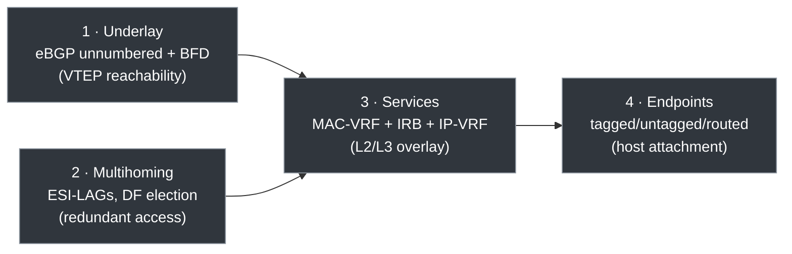
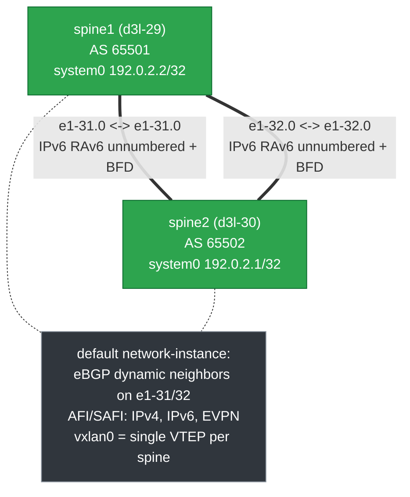
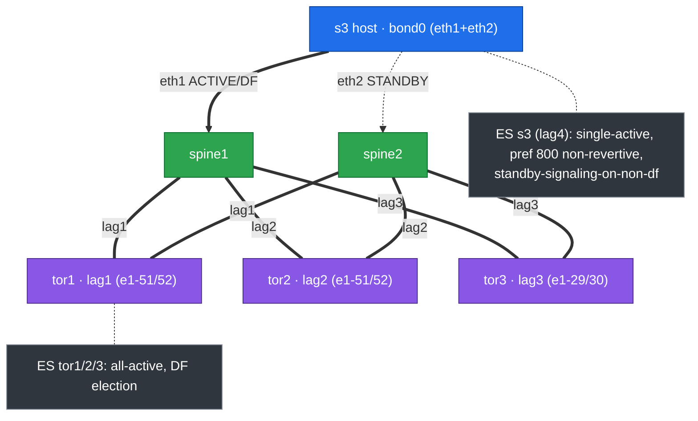
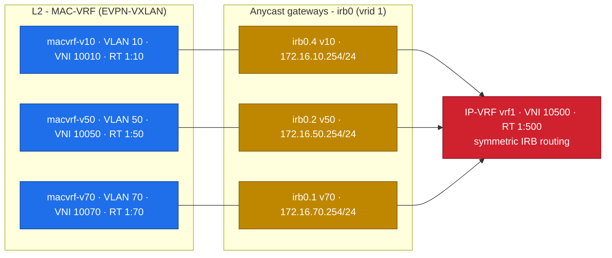
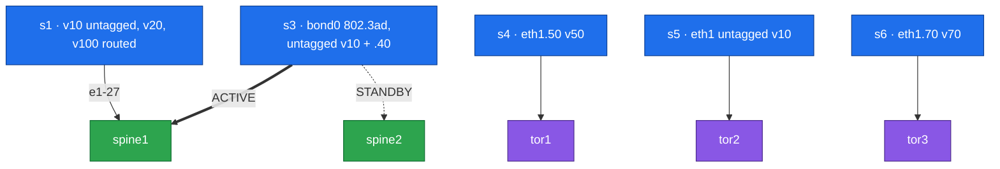

# Collapsed Spine NVD — Ansible Variant

> **Status: prototype / early stage.** This is a map and a rationale for peers —
> *where things are* and *the thinking behind the structure and tooling* — not
> finished end-user docs. Poke holes.

An Ansible-driven build of the collapsed-spine EVPN-VXLAN fabric (2 spines, 3 ToRs)
on [Containerlab](https://containerlab.dev) with Nokia SR Linux. Each node's intent
lives as readable YAML; a filter renders it into native SR Linux config.

Sibling variants build the same topology with other tooling:
[`with-eda`](../collapsed-spine-with-eda/) (EDA-orchestrated) and
[`without-eda`](../collapsed-spine-without-eda/) (static CLI). This variant exists
to explore **declarative, model-driven fabric config as Ansible vars** — no EDA, no
hand-written CLI. Linux endpoints (`s1`–`s6`) are just traffic sources, not the
point.

## Contents

[The ideas](#the-ideas) · [Where things are](#where-things-are) ·
[Try it](#try-it) · [The design](#the-design) ·
[Authoring intent](#authoring-intent) · [Tooling](#tooling) ·
[Pointers](#pointers)

## The ideas

The decisions worth reacting to:

- **Intent is readable YAML, not raw gNMI.** Each node's config lives in
  `ansible/host_vars/<node>.yml` as a plain tree under `srl_config`. A filter
  renders it to native `nokia.srlinux.config` paths. You think in structure, not in
  gNMI path strings.
- **One validated transaction per node.** By default `srl_config` uses the official
  Nokia module flow: validate the rendered intent, ask SR Linux for the diff, and
  apply only when the device reports a change. Optional host-side pruning can be
  enabled when smaller config payloads matter more than using device-side diff as
  the only reducer.
- **`update:` + targeted `delete:`, not `replace:`.** Changes stay non-destructive on
  shared/lab nodes; we prune only known defaults explicitly instead of enumerating
  every leaf to own a path. `replace:` exists but is opt-in.
- **List-keys come from the released path catalog, not guesswork.**
  the nokia.srlinux collection ships a list-key catalog generated from SR
  Linux's `paths.json` (`scripts/sync-srl-list-keys` in the collection repo), so
  the renderer keys YANG lists by full path context (the same node
  name can key on `name` in one place and `index` in another).

## Where things are

```text
ansible/
  inventory.yml                   # nodes + groups (srl, collapsed_spines, linux_clients)
  host_vars/<node>.yml            # per-node intent — the source of truth
  roles/
    linux_endpoint/               # configure the traffic-source containers
  # srl_config / srl_validate roles and the srl intent renderer live in the
  # nokia.srlinux collection fork (requirements.yml pins tag v1.2.0-md.1)
playbooks/
  deploy.yml                      # apply intent
  validate.yml                    # assert state (BGP, ES, LAG, pings)
tools/
  clab-network-tester             # data-plane traffic generator across endpoints
2-way-collapsed-spine.clab.yaml   # topology
```

## Try it

From this directory (the one with `pyproject.toml`). Use `uv run`, not `uvx` — the
bare `uvx` path misses the Python libs the endpoints need:

```bash
uv sync
uv run ansible-galaxy collection install -r requirements.yml

containerlab deploy -t 2-way-collapsed-spine.clab.yaml      # expect 11 nodes

uv run ansible-playbook playbooks/deploy.yml --tags srl_schema_check
uv run ansible-playbook playbooks/deploy.yml                # apply intent
sleep 20                                                    # let LACP / ES converge
uv run ansible-playbook playbooks/validate.yml              # assert state
uv run ansible-playbook playbooks/deploy.yml                # idempotency: changed=0
```

Tested with SR Linux `25.3.2`, `ansible-core` `2.21.0`, `nokia.srlinux` `1.2.0`
(md fork tag `v1.2.0-md.1`, list-key catalog `v25.10.1`).
SR Linux login: `admin` / `NokiaSrl1!` (e.g. `ssh admin@172.21.21.101`).

> **Note:** Linux endpoint config is ephemeral — a `containerlab` redeploy wipes
> it, so re-run `deploy.yml` (or `--limit linux_clients`) after one. The SR Linux
> fabric config persists across redeploys.

## The design

What the fabric actually builds, and why. **The one big idea:** the two spines run
an *eBGP underlay* carrying an *EVPN-VXLAN overlay*. The underlay's only job is to
make every spine's loopback (VTEP) reachable; the overlay then builds all L2 and L3
services on top by exchanging EVPN routes. The build order — and the right
deploy/automation order — is **(1) underlay → (2) multihoming → (3) services →
(4) endpoints**.



Remove any lower layer and everything above it stops working. Values below are
verified against the without-EDA configs (`../collapsed-spine-without-eda/configs/*.cli`).
Color legend: green = spine, purple = ToR, blue = host, grey = annotation.

### 1 — Underlay (eBGP unnumbered + BFD)



Two physical links (`e1-31`, `e1-32`) tie the spines together, running **eBGP**
(each spine its own AS) to exchange the `system0` loopbacks that every VXLAN tunnel
is sourced from. Why this shape:

- **eBGP underlay:** simple, scales horizontally, loop-free by AS-path; one protocol
  carries underlay (IPv4/IPv6) *and* overlay (EVPN) address families.
- **Unnumbered (IPv6 link-local + RA):** no /31 planning per link; BGP
  auto-discovers the neighbor. Less config, trivial to add links.
- **Two parallel ISLs:** ECMP bandwidth *and* redundancy.
- **BFD:** sub-second failure detection instead of the BGP hold timer.

### 2 — Access & EVPN multihoming (all-active vs single-active)



Every access device connects to *both* spines as one logical LAG. EVPN multihoming
makes two independent spines behave like one LACP peer via a shared **Ethernet
Segment Identifier (ESI)** — **no MLAG peer-link**; the spines coordinate over EVPN
BGP. Two modes are proven on purpose:

- **all-active** (tor1/2/3): both links forward — sum of bandwidth + instant
  failover. The throughput default.
- **single-active** (`s3`/`lag4`): one link forwards, the other is standby. Proves
  the harder case: `preference 800`, `non-revertive`, and
  `standby-signaling-on-non-df` (keep the host's backup link down until needed).

**DF election** picks one spine per segment to forward BUM traffic; **split-horizon**
(via the ESI) stops a host's own frame looping back through the other spine. The host
runs a *standard* 802.3ad bond — unaware two switches are involved.

### 3 — EVPN service stack (L2 MAC-VRF + L3 IP-VRF)



Read bottom-up as three layers (the lab runs VLANs 10/20/30/40/50/70; three shown):

1. **MAC-VRF (L2):** each VLAN is a bridge table mapped to a **VXLAN VNI** + **EVI**.
   Local MACs are advertised as **EVPN Type-2 routes**; the **Route Target** controls
   which VRFs import them.
2. **IRB anycast gateway (L2↔L3):** `irb0.x` is the default gateway — *both* spines
   answer on the same IP/MAC, so the gateway is always one hop away and failover is
   instant.
3. **IP-VRF (L3):** `vrf1` routes between subnets via **symmetric IRB** (VNI 10500),
   so only source and destination VRFs need the route, not every transit node.

EVPN is a **control plane** (MACs/IP-MAC bindings advertised over BGP), not
flood-and-learn — less broadcast, faster convergence, built-in ARP/ND suppression.

### 4 — Endpoint connectivity



The hosts exist to validate the *awkward* cases, not just the happy path: L2 untagged
(`s5`), L2 tagged (`s4`/`s6`), L3 routed access (`s1`/`s2` eth1.100 →
`172.16.100.2/31`, dual-stack), all-active multihoming (ToR-attached), and
single-active multihoming (`s3` bond0). End to end: **host VLAN → MAC-VRF → IRB
anycast GW → IP-VRF → VXLAN over eBGP underlay → remote spine → destination host.**

## Authoring intent

How a config change flows from model to device:

```text
SR Linux YANG Browser -> host_vars/<node>.yml -> nokia.srlinux.to_config_operations filter -> validate -> config
   (find the path)       (readable srl_config)   (native operations)   (device diff)
```

You author intent with three buckets under `srl_config`. The filter
(`nokia.srlinux.to_config_operations`) renders the full intent, the role
validates it, and `nokia.srlinux.config` asks SR Linux for the effective diff
before applying. If SR Linux reports no diff, the config module exits unchanged.
When host-side pruning is explicitly enabled, the role first reads running config,
prunes unchanged operations on the Ansible host, and sends only the local delta to
validate/config. It has no `state:` keyword; these are the equivalent:

| Bucket | Maps to | Meaning | State-module analogue |
| --- | --- | --- | --- |
| `update:` | `update` | Merge — add/modify only the leaves you list; the rest is left alone | `state: merged` |
| `replace:` | `replace` | Replace the exact generated path (`{}` marks a container/list path) | `state: replaced` at that path |
| `delete:` | `delete` | Remove the targeted subtree (`{}` marks the point to prune) | `state: absent` |

- Use **`update:`** for normal additive intent — safe, non-destructive.
- Use **`delete:`** to prune known config (e.g. factory `ssh-key: {}` placeholders).
- Use **`replace:`** only when automation must fully own a generated path. It is
  **path-scoped, not global** — `replace: {interface: {ethernet-1/55: {admin-state:
  enable}}}` replaces that *leaf*, not the whole interface. Use `{}` to target a
  container/list path exactly. Never root-level replace a live node, or you must
  declare every required leaf (mgmt network-instance, AAA, TLS) and can lock yourself
  out mid-transaction.

This design uses `update:` + targeted `delete:` by choice: non-destructive on shared
nodes, prunes only known defaults, no burden of enumerating every leaf.

### The `srl_config` dialect

Rules for translating a path from the
[YANG Browser](https://yangbrowser.nokia.com/srlinux) into `host_vars/`:

- Keyed YANG lists become YAML map keys directly below the list node.
- Scalar leaves become scalar YAML values.
- A single-key list may use scalar shorthand only when the entry has no child leaves.
- `{}` means an intentional empty payload at that exact path (presence/empty in
  `update:`/`replace:`; the point to prune in `delete:`).
- Shorthand like `encap: untagged`, `primary: true`, `activation-timer`, and
  `interface-standby-signaling-on-non-df` is renderer behavior in the collection's renderer,
  not generic YANG.
- Paths marked `is-state: true` in the catalog are read-only — they don't render to
  config; read/validate them instead.

**Worked translations** — official path → readable `srl_config` → what renders:

```text
/interface[name=ethernet-1/51]/description
```
```yaml
srl_config: {update: {interface: {ethernet-1/51: {description: tor2-spine-lag}}}}
# update /interface[name=ethernet-1/51]/description = "tor2-spine-lag"
```

```text
/interface[name=irb0]/subinterface[index=1]/ipv4/arp/evpn/advertise[route-type=dynamic]
```
```yaml
srl_config:
  update: {interface: {irb0: {subinterface: {'1': {ipv4: {arp: {evpn: {advertise: dynamic}}}}}}}}
# single-key list scalar shorthand -> update at .../advertise[route-type=dynamic] = {}
```

```text
/network-instance[name=v10-simple]/interface[name=lag1.4096]
```
```yaml
srl_config: {update: {network-instance: {v10-simple: {interface: {lag1.4096: {}}}}}}
# presence target -> update .../interface[name=lag1.4096] = {}
```

```text
/system/aaa/authentication/admin-user/ssh-key
```
```yaml
srl_config: {delete: {system: {aaa: {authentication: {admin-user: {ssh-key: {}}}}}}}
# delete .../ssh-key (no value)
```

Note the same node name can key differently by context —
`network-instance/vxlan-interface` keys on `name`, `tunnel-interface/vxlan-interface`
keys on `index`. The renderer resolves this from the path catalog, not the bare name.

### List-key sync

The collection renderer keys YANG lists by full path context using its bundled
catalog. Keep that map honest with `scripts/sync-srl-list-keys` (collection repo), which
fetches a release `paths.json`, extracts `type=[list]` entries, and compares the
discovered keys with `LIST_KEY_PATHS`:

```bash
uv run scripts/sync-srl-list-keys --version v25.10.1          # check against a release
uv run scripts/sync-srl-list-keys --version v25.10.1 --sync   # regenerate the map
```

Before generating a live preview or applying intent, the `srl_config` role reads
the live SR Linux version and compares it with `SRL_LIST_KEYS_VERSION`. If a
device is newer than the checked-in catalog, the role fails before payload
rendering, device validation, diff generation, or config apply. This keeps
`--check --diff` from showing a diff built from stale schema metadata.
`deploy.yml` sets `any_errors_fatal: true` on the `srl` play, so a single newer
node aborts the whole fabric apply rather than excluding itself while siblings
deploy.

The guard compares down to the patch level, so even a patch bump (for example
`v25.3.2` to `v25.3.3`) trips it by design; re-sync the catalog as below. The
inverse direction is intentionally not guarded: a same-or-newer catalog against
an older device is allowed, since SR Linux's own `nokia.srlinux.validate`
remains the schema backstop at apply. The guard is tag-gated on
`srl_schema_check`, so `--skip-tags srl_schema_check` disables it; don't combine
that flag with a live deploy.

Use the tagged preflight for a no-apply schema check:

```bash
uv run ansible-playbook playbooks/deploy.yml --tags srl_schema_check
```

When moving the lab to a newer SR Linux release, upgrade the local inventory
metadata first:

```bash
uv run scripts/sync-srl-list-keys --version v26.3.1 --sync    # in the collection repo
uv run pytest
uv run ansible-playbook playbooks/deploy.yml --syntax-check
uv run ansible-lint playbooks/deploy.yml playbooks/validate.yml
```

Then review `ansible/host_vars/` and `ansible/group_vars/` for release-specific
schema changes before deploying. SR Linux still enforces schema truth at deploy via
`nokia.srlinux.validate`; the version guard only prevents using older renderer
metadata against a newer device.

Optional host-side pruning is available with:

```bash
uv run ansible-playbook playbooks/deploy.yml --check --diff -e srl_config_prune_unchanged_on_host=true
```

This asks SR Linux for current running values, computes a local delta on the
Ansible host, and skips validate/config when that delta is empty. It is useful for
testing reduced payloads, but the default remains device-side diff because SR
Linux has the final schema and value-normalization truth.

### Design rules

- Inventory + `host_vars/` are the deployable intent; add `group_vars/` only for
  shared values actually consumed by roles.
- No `intent/` directory; no stored rendered JSON / generated payloads / resource
  sidecars.
- Plain YAML scalars for leaves, `{}` for presence-only; no private marker keys.
- No `rpc_*` roles or Jinja-templated SR Linux JSON.
- Keep the spines asymmetric where the design is asymmetric.
- Keep endpoint setup in Ansible, not Containerlab `exec` startup blocks.

## Tooling

- **`scripts/sync-srl-list-keys`** (collection repo) — syncs list-key rendering against a given SR Linux
  release (see [List-key sync](#list-key-sync)).
- **`tools/clab-network-tester`** — self-contained `uv` script that generates
  source-bound endpoint traffic across the real data plane. Auto-detects the topology
  and loads `network-tests/2-way-collapsed-spine.yml`; reads `ansible/inventory.yml`
  and `host_vars/` so the Ansible intent stays the source of truth.

  ```bash
  tools/clab-network-tester --list                 # discovered addresses, cases, flows
  tools/clab-network-tester --once                 # full dual-stack mesh, once
  tools/clab-network-tester --flow s1-to-s4 --capture-hints   # one long-running flow
  tools/clab-network-tester --dry-run ...          # print docker exec ... ping cmds
  ```

## Pointers

- [SR Linux YANG Browser](https://yangbrowser.nokia.com/srlinux) — model & paths
- [learn.srlinux.dev](https://learn.srlinux.dev) ·
  [Ansible collection tutorial](https://learn.srlinux.dev/tutorials/programmability/ansible/using-nokia-srlinux-collection/)
- [`nokia.srlinux` on Galaxy](https://galaxy.ansible.com/ui/repo/published/nokia/srlinux/)
  · [SR Linux docs](https://documentation.nokia.com/srlinux/)
- [Containerlab](https://containerlab.dev/install/) ·
  [SR Linux kind](https://containerlab.dev/manual/kinds/srl/)
- Issues: [nokia/nokia-validated-designs](https://github.com/nokia/nokia-validated-designs)
  · Chat: [Containerlab / SR Linux Discord](https://discord.gg/vAyddtaEV9)
