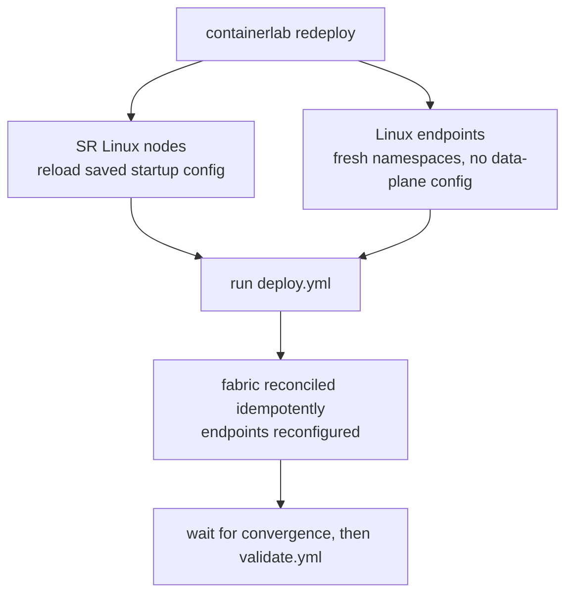

# Collapsed Spine NVD with Ansible

Ansible-managed deployment of the collapsed-spine Nokia Validated Design using
Containerlab, SR Linux, and Linux endpoint containers.


## What This Variant Does

This lab uses the same topology and service intent as the non-EDA collapsed
spine variant, but Ansible owns the deployment lifecycle.

| Area | Owner | Notes |
| --- | --- | --- |
| SR Linux fabric | `nokia.srlinux` | One config transaction per SR Linux node |
| Linux endpoints | `community.docker` | VLANs, bonds, addresses, routes, and ping checks |
| Topology | Containerlab | No endpoint startup `exec` blocks |
| Intent | Ansible vars | Inventory and `host_vars/` are the source of truth; add `group_vars/` only when shared values are consumed |

Covered connectivity cases:

- Layer 2 untagged server connectivity.
- Layer 2 tagged server connectivity.
- Layer 3 server connectivity.
- All-active EVPN Ethernet Segment LAG multihoming.
- Single-active EVPN Ethernet Segment multihoming with LACP standby signaling.
- IPv4 and IPv6 validation across the endpoint use cases.

## The Short Path

Run from this directory (the one containing `pyproject.toml`):

```bash
uv sync
uv run ansible-galaxy collection install -r requirements.yml

containerlab deploy -t 2-way-collapsed-spine.clab.yaml
containerlab inspect -t 2-way-collapsed-spine.clab.yaml

uv run ansible-playbook playbooks/deploy.yml      # apply intent (fabric + endpoints)
sleep 20                                           # let LACP / Ethernet Segments converge
uv run ansible-playbook playbooks/validate.yml    # assert state
uv run ansible-playbook playbooks/deploy.yml      # idempotency check
```

The last deploy is the idempotency check. A healthy final recap has
`changed=0` and `failed=0` for every host.

Do not run the playbooks with only `uvx --from ansible-core ...`; that misses
the Python libraries required by `community.docker`. Use `uv run ...` from this
directory.

## Deployment Lifecycle and State Persistence

This is the single most important operational fact for this lab:

> **After every `containerlab` (re)deploy you must re-run `playbooks/deploy.yml`.**
> The SR Linux fabric config survives a redeploy; the Linux endpoint config does not.

Why the two halves behave differently:

- **SR Linux nodes persist.** `srl_config` runs with `save_when: changed`, which
  writes the running config to each node's startup. Containerlab stores that under
  `clab-2-spine-collapsed/<node>/` and reloads it on the next deploy, so the fabric
  comes back configured (network-instances, LAGs, Ethernet Segments) even without
  Ansible.
- **Linux endpoints are ephemeral.** The `linux_endpoint` role applies VLANs,
  bonds, addresses, and routes with `ip` commands inside the containers (no
  Containerlab `exec` startup blocks, by design). A container redeploy creates
  fresh namespaces, so all of that is gone until `deploy.yml` runs again. The
  tell-tale symptom is `ping: bind: Address not available` in `validate.yml`,
  because the endpoint source IPs are missing.



To reset endpoints only (fast path after a redeploy when the fabric is unchanged):

```bash
uv run ansible-playbook playbooks/deploy.yml --limit linux_clients
```

## Requirements

| Requirement | Why |
| --- | --- |
| Docker | Runs SR Linux and endpoint containers |
| Containerlab | Builds the lab topology |
| `uv` | Provides the pinned Ansible runtime |
| GHCR access | Pulls `ghcr.io/nokia/srlinux:25.3.2` |

Tested components:

| Component | Version |
| --- | --- |
| SR Linux image | `25.3.2` |
| `ansible-core` | `2.21.0` |
| `ansible-lint` | `26.4.0` |
| `nokia.srlinux` collection | `1.1.0` |
| `community.docker` collection | `3.13.4` |

## Lab Inventory

| Node | Type | Management |
| --- | --- | --- |
| `spine1` | SR Linux spine | `172.21.21.101` |
| `spine2` | SR Linux spine | `172.21.21.102` |
| `tor1` | SR Linux ToR | `172.21.21.11` |
| `tor2` | SR Linux ToR | `172.21.21.12` |
| `tor3` | SR Linux ToR | `172.21.21.13` |
| `s1`..`s6` | Linux endpoints | Docker container names |

SR Linux credentials:

```text
username: admin
password: NokiaSrl1!
```

The topology uses `prefix: ""`, so the Linux containers are named `s1`, `s2`,
`s3`, `s4`, `s5`, and `s6`. If the topology prefix changes, update
`ansible/inventory.yml` before running the endpoint play.

## Project Layout

```text
collapsed-spine-with-ansible/
  2-way-collapsed-spine.clab.yaml
  ansible.cfg
  pyproject.toml
  requirements.yml
  ansible/
    inventory.yml
    host_vars/
    filter_plugins/srl_payload.py
    roles/
      srl_config/
      linux_endpoint/
      srl_validate/
  playbooks/
    deploy.yml
    validate.yml
  tests/
    test_srl_payload.py
```

Read-only fidelity oracles:

```text
../collapsed-spine-without-eda/configs/*.cli
../collapsed-spine-without-eda/base-configs/*.sh
```

## Runbook

Prepare the Python runtime and Ansible collections:

```bash
uv sync
uv run ansible-galaxy collection install -r requirements.yml
```

Start or refresh the topology:

```bash
containerlab deploy -t 2-way-collapsed-spine.clab.yaml
containerlab inspect -t 2-way-collapsed-spine.clab.yaml
```

Expected lab size:

```text
11 nodes: spine1 spine2 tor1 tor2 tor3 s1 s2 s3 s4 s5 s6
```

Run static checks:

```bash
uv run ansible-playbook playbooks/deploy.yml --syntax-check
uv run ansible-lint playbooks/deploy.yml playbooks/validate.yml
```

Preview config changes:

```bash
uv run ansible-playbook playbooks/deploy.yml --check --diff
```

Deploy:

```bash
uv run ansible-playbook playbooks/deploy.yml
```

Validate:

```bash
uv run ansible-playbook playbooks/validate.yml
```

`validate.yml` reads device state once and does not wait for LACP to converge.
Run it a few seconds after a fresh deploy or boot (see "The Short Path"). If LAG
or Ethernet Segment assertions fail immediately after deploy but the links are
actually up (`docker exec spine1 sr_cli "info from state interface lag1
oper-state"`), it is a convergence race: wait and re-run.

Check idempotency:

```bash
uv run ansible-playbook playbooks/deploy.yml
```

## Expected Results

| Gate | Good result |
| --- | --- |
| Collection install | `Nothing to do` or successful install |
| Containerlab inspect | 11 nodes shown as running |
| Syntax check | `playbook: playbooks/deploy.yml` |
| Lint | `Passed: 0 failure(s), 0 warning(s)` |
| Deploy | `failed=0` |
| Validate | `failed=0` |
| Idempotency | `changed=0 failed=0` |

Validation checks include BGP neighbors, Ethernet Segments, LAG health,
network-instance presence, same-VLAN pings, routed pings, VLAN 10 across
spine1 untagged and spine2 tagged access, and the `s3` bond.

Single-active non-DF LAG state may show `standby-signaling`. That is expected
for this design and is treated as healthy by validation.

Timing matters: `validate.yml` samples state once with no retry for LAG/ES
convergence. Spine LAGs settle slightly later than ToR LAGs, so validating in
the first seconds after a deploy can fail spine `lag1`..`lag4` even though they
come up moments later. Allow ~15-20s after deploy before validating. Endpoint
ping checks do retry (5 attempts), so they tolerate brief delays but not missing
endpoint config (run `deploy.yml` first).

## Common Operations

Limit deployment to one SR Linux node:

```bash
uv run ansible-playbook playbooks/deploy.yml --limit spine1
```

Validate only spines:

```bash
uv run ansible-playbook playbooks/validate.yml --limit collapsed_spines
```

Run with more detail:

```bash
uv run ansible-playbook playbooks/deploy.yml --limit spine1 -vvv
```

Use an SR Linux confirmed commit timeout:

```bash
uv run ansible-playbook playbooks/deploy.yml -e srl_confirm_timeout=300
```

Override save behavior:

```bash
uv run ansible-playbook playbooks/deploy.yml -e srl_save_when=always
```

Tear down the lab:

```bash
containerlab destroy -t 2-way-collapsed-spine.clab.yaml --cleanup
```

`--cleanup` also deletes the saved SR Linux startup config under
`clab-2-spine-collapsed/`, so the next `deploy` starts the fabric from factory
state. Omit `--cleanup` to keep the fabric config across a redeploy. Either way,
re-run `playbooks/deploy.yml` afterwards to restore the (always-ephemeral)
endpoint config.

## Manual Checks

Open an SR Linux CLI:

```bash
ssh admin@172.21.21.101
```

Run an SR Linux command through Ansible:

```bash
uv run ansible all --limit srl \
  -m nokia.srlinux.cli \
  -a '{"commands":["show system information"]}'
```

Inspect endpoint state:

```bash
docker exec s3 ip -br link
docker exec s3 cat /proc/net/bonding/bond0
docker exec s1 ip route
docker exec s1 ip rule
```

Run endpoint pings by hand:

```bash
docker exec s1 ping -c 3 172.16.10.2
docker exec s1 ping -c 3 -I 172.16.20.1 172.16.50.4
docker exec s1 ping6 -c 3 -I 2001:db8:0:20::1 2001:db8:0:50::4
```

## Data-Plane Tests

Use `tools/clab-network-tester` to generate endpoint traffic across the real
data plane. The executable is a self-contained `uv` script. It auto-detects the
single Containerlab topology in this directory and loads the matching network
test config:

```text
2-way-collapsed-spine.clab.yaml
network-tests/2-way-collapsed-spine.yml
```

The config points at `ansible/inventory.yml` and `ansible/host_vars/`, so the
Ansible endpoint intent remains the source of truth. The tester runs
source-bound pings from the Linux endpoint containers and does not use
`172.21.21.0/24` management addresses as ping sources or targets.

List the discovered endpoint addresses, generated cases, and named flows:

```bash
tools/clab-network-tester --list
```

Continuously warm up and check the full dual-stack endpoint mesh:

```bash
tools/clab-network-tester
```

Continuous mesh mode uses a compact live monitor. It shows sweep cadence,
current cycle progress, totals, the last completed cycle, and recent failures.
It does not print every successful ping or show a fast-changing current target.
The default lab cadence is one full sweep followed by a 30-second pause, which
keeps IPv4 ARP entries active without creating constant terminal churn.

To change the mesh cadence:

```bash
tools/clab-network-tester --ipv4 --interval 60
```

In mesh mode, `--interval` is the pause after a completed sweep. In focused
`--flow` mode, `--interval` is the packet interval for that single long-running
ping.

Run the same continuous mesh for five minutes:

```bash
tools/clab-network-tester --duration 300
```

Run the full dual-stack endpoint mesh once:

```bash
tools/clab-network-tester --once
```

Run only IPv4 endpoint-to-gateway checks:

```bash
tools/clab-network-tester --test gateways --ipv4 --once
```

Generate the configured `s1` to `s4` long-running flow for packet capture:

```bash
tools/clab-network-tester --flow s1-to-s4 --interval 0.2 --capture-hints
```

Run that same capture flow for a fixed time:

```bash
tools/clab-network-tester --flow s1-to-s4 --duration 120
```

Use `--dry-run` with any command to print the exact `docker exec ... ping -I`
commands without sending traffic.

## Troubleshooting

| Symptom | Likely cause | Fix |
| --- | --- | --- |
| `Failed to import the required Python library (requests)` | Playbook was run with `uvx --from ansible-core` instead of the project runtime | Run `uv sync`, then `uv run ansible-playbook playbooks/validate.yml` |
| `containerlab: command not found` | Containerlab is not installed or not in `PATH` | Install Containerlab and rerun the deploy command |
| SR Linux HTTPS connection fails | Node is not running, IP mismatch, or API not ready yet | Run `containerlab inspect -t 2-way-collapsed-spine.clab.yaml` and compare with `ansible/inventory.yml` |
| Fewer than 11 nodes in inspect output | Topology did not fully start | Check `docker ps -a`, destroy with `--cleanup`, and deploy again |
| `nokia.srlinux.validate` fails | Payload path/value shape does not match the SR Linux model | Re-run with `-vvv` and fix readable vars or `ansible/filter_plugins/srl_payload.py` |
| `ping: bind: Address not available` | Endpoint config was wiped by a containerlab redeploy (endpoints are ephemeral; see "Deployment Lifecycle and State Persistence") | Run `uv run ansible-playbook playbooks/deploy.yml --limit linux_clients` |
| Endpoint routed pings fail | Endpoint source policy/routing state is missing or stale | Re-run `uv run ansible-playbook playbooks/deploy.yml --limit linux_clients` |
| `LAG lagN is not operationally healthy` on spines right after deploy | LACP/ES convergence race; `validate.yml` sampled state too early | Wait ~15-20s and re-run `validate.yml`; confirm with `docker exec spine1 sr_cli "info from state interface lagN oper-state"` |
| `validate.yml` fails widely right after a redeploy | `deploy.yml` was not re-run, so endpoints are unconfigured and LAGs may still be converging | Run `uv run ansible-playbook playbooks/deploy.yml`, wait for convergence, then validate |
| `s3` bond validation fails | Linux bond or connected SR Linux LAG/ES is down | Check `docker exec s3 cat /proc/net/bonding/bond0` and validate `s3:spine1:spine2` |
| Second deploy reports changes | Something is not round-tripping idempotently | Run `uv run ansible-playbook playbooks/deploy.yml --check --diff -vv` on the changed host |

Useful troubleshooting commands:

```bash
docker pull ghcr.io/nokia/srlinux:25.3.2
docker ps --format '{{.Names}}' | sort
rg -n '^prefix:|ansible_host: s[1-6]' 2-way-collapsed-spine.clab.yaml ansible/inventory.yml
uv run ansible-playbook playbooks/validate.yml --limit 's3:spine1:spine2'
```

## Intent Model: `set`, `replace`, `delete`

Node vars in `host_vars/` are written as a readable tree under `srl_config`.
The `srl_payload` filter (`ansible/filter_plugins/srl_payload.py`) turns that
tree into native `nokia.srlinux.config` operations, and the device applies them
in one transaction (deletes first, then replaces, then updates).

You author intent with three buckets:

| Bucket | Maps to | Meaning | "State module" equivalent |
| --- | --- | --- | --- |
| `set:` | `update` | Merge: add/modify only the leaves you list; undescribed config is left alone | `state: merged` |
| `replace:` | `replace` | Replace the exact generated path; non-empty trees walk to leaf paths, while `{}` marks a container/list path | `state: replaced` at that path |
| `delete:` | `delete` | Remove the targeted subtree (use `{}` to mark the point to prune) | `state: absent` |

The Nokia module has no `state:` keyword; these operations are the equivalent.
All three buckets are wired through the filter (`payload_from_config`) and the
role, so choosing between them is purely a vars-authoring decision. The
transformation is covered by unit tests in `tests/test_srl_payload.py`
(run `uv run pytest`).

How to think about it:

- Use `set:` for normal additive intent. It is safe and non-destructive.
- Use `delete:` to prune known config (for example the factory-default
  `ssh-key: {}` placeholders).
- Use `replace:` only when automation must be the single source of truth for a
  generated path and should purge any local config below that path.

Important: `replace` is **path-scoped**, not global. Replacing at
`/interface[name=ethernet-1/55]/admin-state` replaces only that leaf. A
non-empty readable tree such as `replace: {interface: {ethernet-1/55:
{admin-state: enable}}}` generates that leaf path, not a whole-interface replace.
Use `{}` only when the exact container/list path is the intended replace target,
for example `replace: {interface: {ethernet-1/55: {}}}` generates
`/interface[name=ethernet-1/55]` with an empty value. Replacing at the root would
force the entire running config to match your vars. Avoid root-level replace on a
live node — you must then declare every leaf the node needs (management
network-instance, AAA, TLS profiles), or you can lock yourself out
mid-transaction.

This design deliberately uses `set:` plus targeted `delete:` rather than
`replace:`. It keeps changes non-destructive on shared/lab nodes, prunes only
known defaults explicitly, and avoids the burden of enumerating every required
leaf. Reach for `replace:` only when the generated path is config this automation
fully owns.

## SR Linux `srl_config` Dialect

The readable YAML in `host_vars/` is an abstraction on top of the official SR
Linux YANG/device implementation. Operators do not write raw gNMI paths, but
`nokia.srlinux.config` still receives native path/value operations.

Use these dialect rules when translating a path from the SR Linux YANG Browser:

- Keyed YANG lists become YAML map keys directly below the list node.
- Scalar leaves become scalar YAML values.
- A single-key list may use scalar shorthand only when the target list entry has
  no child leaves to set.
- `{}` means an intentional empty payload at that exact path. In `set:` or
  `replace:` it creates an empty/presence target; in `delete:` it marks the path
  to remove.
- Local shorthand such as `encap: untagged`, `primary: true`,
  `activation-timer`, and `interface-standby-signaling-on-non-df` is renderer
  behavior in `ansible/filter_plugins/srl_payload.py`, not generic YANG syntax.

### Worked Translations

Each example starts with an official/gNMI-style path, then shows the readable
`srl_config` shape and the operation rendered for `nokia.srlinux.config`.

Keyed list as YAML map key:

```text
/interface[name=ethernet-1/51]/description
```

```yaml
srl_config:
  set:
    interface:
      ethernet-1/51:
        description: tor2-spine-lag
```

Renders an update at
`/interface[name=ethernet-1/51]/description` with value `tor2-spine-lag`.

Scalar leaf value:

```text
/system/name/host-name
```

```yaml
srl_config:
  set:
    system:
      name:
        host-name: d3l-29-spine1
```

Renders an update at `/system/name/host-name` with value `d3l-29-spine1`.

Single-key list scalar shorthand, when there are no child leaves:

```text
/interface[name=irb0]/subinterface[index=1]/ipv4/arp/evpn/advertise[route-type=dynamic]
```

```yaml
srl_config:
  set:
    interface:
      irb0:
        subinterface:
          '1':
            ipv4:
              arp:
                evpn:
                  advertise: dynamic
```

Renders an update at
`/interface[name=irb0]/subinterface[index=1]/ipv4/arp/evpn/advertise[route-type=dynamic]`
with value `{}`.

Presence or empty target with `{}`:

```text
/network-instance[name=v10-simple]/interface[name=lag1.4096]
```

```yaml
srl_config:
  set:
    network-instance:
      v10-simple:
        interface:
          lag1.4096: {}
```

Renders an update at
`/network-instance[name=v10-simple]/interface[name=lag1.4096]` with value `{}`.

Delete of the factory SSH key:

```text
/system/aaa/authentication/admin-user/ssh-key
```

```yaml
srl_config:
  delete:
    system:
      aaa:
        authentication:
          admin-user:
            ssh-key: {}
```

Renders a delete operation for
`/system/aaa/authentication/admin-user/ssh-key` with no value.

`network-instance/vxlan-interface`, keyed by `name`:

```text
/network-instance[name=macvrf-v50]/vxlan-interface[name=vxlan0.502]
```

```yaml
srl_config:
  set:
    network-instance:
      macvrf-v50:
        vxlan-interface: vxlan0.502
```

Renders an update at
`/network-instance[name=macvrf-v50]/vxlan-interface[name=vxlan0.502]` with value
`{}`.

`tunnel-interface/vxlan-interface`, keyed by `index`:

```text
/tunnel-interface[name=vxlan0]/vxlan-interface[index=502]/ingress/vni
```

```yaml
srl_config:
  set:
    tunnel-interface:
      vxlan0:
        vxlan-interface:
          '502':
            type: bridged
            ingress:
              vni: 10050
            egress:
              source-ip: use-system-ipv4-address
```

Renders updates below
`/tunnel-interface[name=vxlan0]/vxlan-interface[index=502]`, including
`/tunnel-interface[name=vxlan0]/vxlan-interface[index=502]/ingress/vni` with
value `10050`.

Untagged VLAN encap shorthand:

```text
/interface[name=ethernet-1/56]/subinterface[index=4096]/vlan/encap/untagged
```

```yaml
srl_config:
  set:
    interface:
      ethernet-1/56:
        subinterface:
          '4096':
            vlan:
              encap: untagged
```

Renders an update at
`/interface[name=ethernet-1/56]/subinterface[index=4096]/vlan/encap/untagged`
with value `{}`.

Primary address shorthand:

```text
/interface[name=irb0]/subinterface[index=1]/ipv4/address[ip-prefix=172.16.70.254/24]/primary
```

```yaml
srl_config:
  set:
    interface:
      irb0:
        subinterface:
          '1':
            ipv4:
              address:
                172.16.70.254/24:
                  primary: true
```

Renders an update at
`/interface[name=irb0]/subinterface[index=1]/ipv4/address[ip-prefix=172.16.70.254/24]/primary`
with value `""`.

Read-only state paths are not authoring targets:

```text
/interface[name=*]/statistics/in-octets
```

```yaml
# Do not author this under srl_config.
```

Paths marked `is-state: true` in the SR Linux path catalog are read-only. They
do not render to `nokia.srlinux.config` operations; read or validate them with
state-oriented tasks instead.

### SR Linux List-Key Sync

`ansible/filter_plugins/srl_payload.py` uses `ansible/srl_list_keys.py` to
render YANG lists by full path context, not by bare node name. This matters
because the same node name can use different YANG keys in different places:

```python
("network-instance", "vxlan-interface") -> ("name",)
("tunnel-interface", "vxlan-interface") -> ("index",)
```

Use `tools/audit-srl-paths` to generate and check `ansible/srl_list_keys.py`
against the released SR Linux path catalog. It fetches the release `paths.json`
artifact from the SR Linux YANG Browser, extracts entries with `type=[list]`,
and compares the discovered list keys with `LIST_KEY_PATHS`.

```bash
tools/audit-srl-paths --version v25.3.2
```

Use a local `paths.json` instead of fetching from GitHub:

```bash
tools/audit-srl-paths --paths-json /path/to/paths.json --version v25.3.2
```

Generate the mapping after changing the target SR Linux release:

```bash
tools/audit-srl-paths --version v25.3.2 --sync-list-keys
```

`srl_payload.py` consumes `srl_list_keys.py` at runtime. SR Linux still enforces
schema truth during deploy with `nokia.srlinux.validate` and
`nokia.srlinux.config`. The same release `paths.json` catalog is the source for
list keys and for path facts such as type, enum values, defaults, and
`is-state`.

Run it when changing `ansible/filter_plugins/srl_payload.py`,
`ansible/srl_list_keys.py`, or any shorthand encoder in `_append_value`. Also
run it before moving this lab to a different SR Linux release:

```bash
tools/audit-srl-paths --version v25.7.2
```

If the generated mapping and tests pass, the renderer's list-key behavior
matches that release.

The repo does not parse YANG itself. It consumes the generated path catalog for
list-key truth and keeps only the local YAML conveniences, such as scalar
address and VXLAN attachment shorthand, in the filter.

## Design Rules

- The Ansible inventory and `host_vars/` are the deployable intent. Add
  `group_vars/` only for shared values that are actually consumed by roles.
- Do not add an `intent/` directory.
- Do not store rendered JSON, generated SR Linux payloads, `srl_resources`, or
  resource inventory sidecars.
- Use plain YAML scalars for leaf values and `{}` for presence-only leaves; no
  private marker keys in vars.
- Do not use `rpc_*` roles or Jinja-templated SR Linux JSON.
- Keep the two spines asymmetric where the design is asymmetric.
- Keep Linux endpoint setup in Ansible, not Containerlab `exec` startup blocks.

## References

- Containerlab deploy: https://containerlab.dev/cmd/deploy/
- Containerlab inspect: https://containerlab.dev/cmd/inspect/
- Ansible check and diff mode: https://docs.ansible.com/projects/ansible/latest/playbook_guide/playbooks_checkmode.html
- Ansible lint usage: https://docs.ansible.com/projects/lint/usage/
- Nokia SR Linux Ansible collection: https://learn.srlinux.dev/tutorials/programmability/ansible/using-nokia-srlinux-collection/
