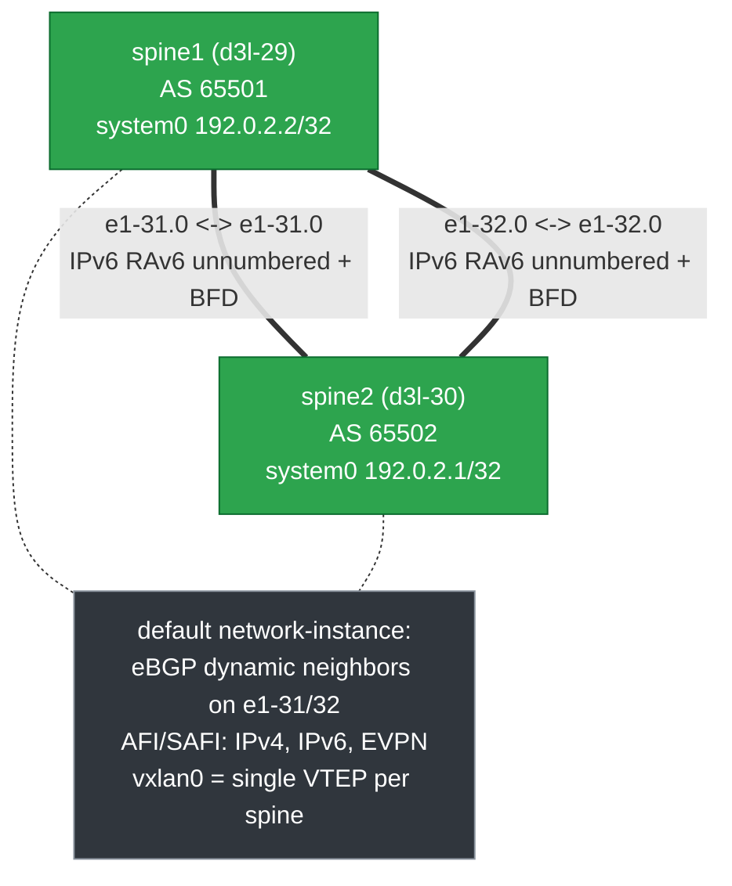
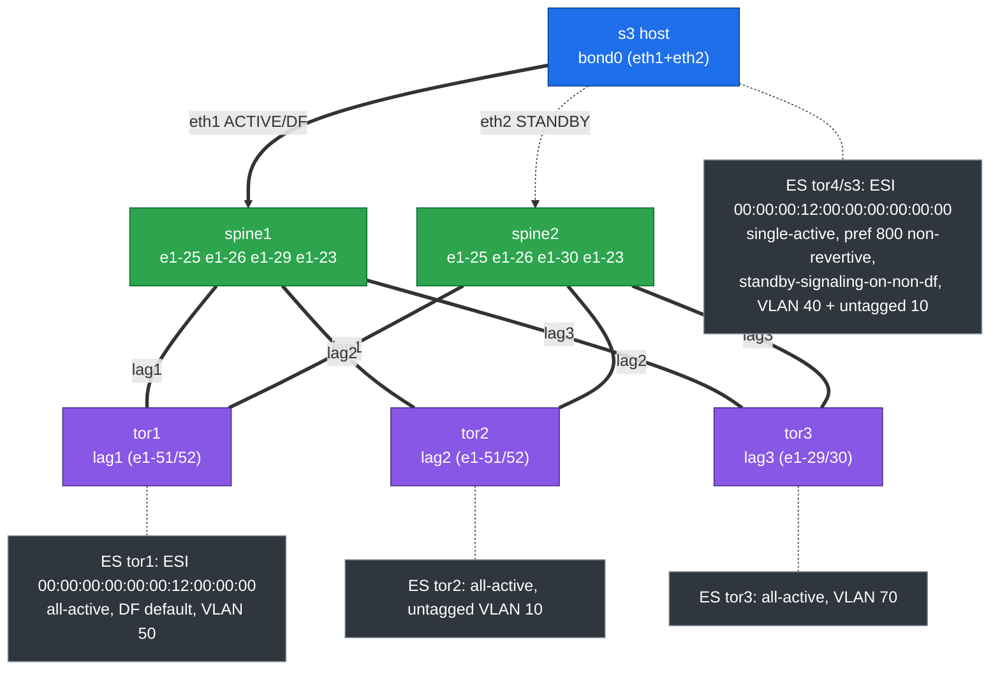
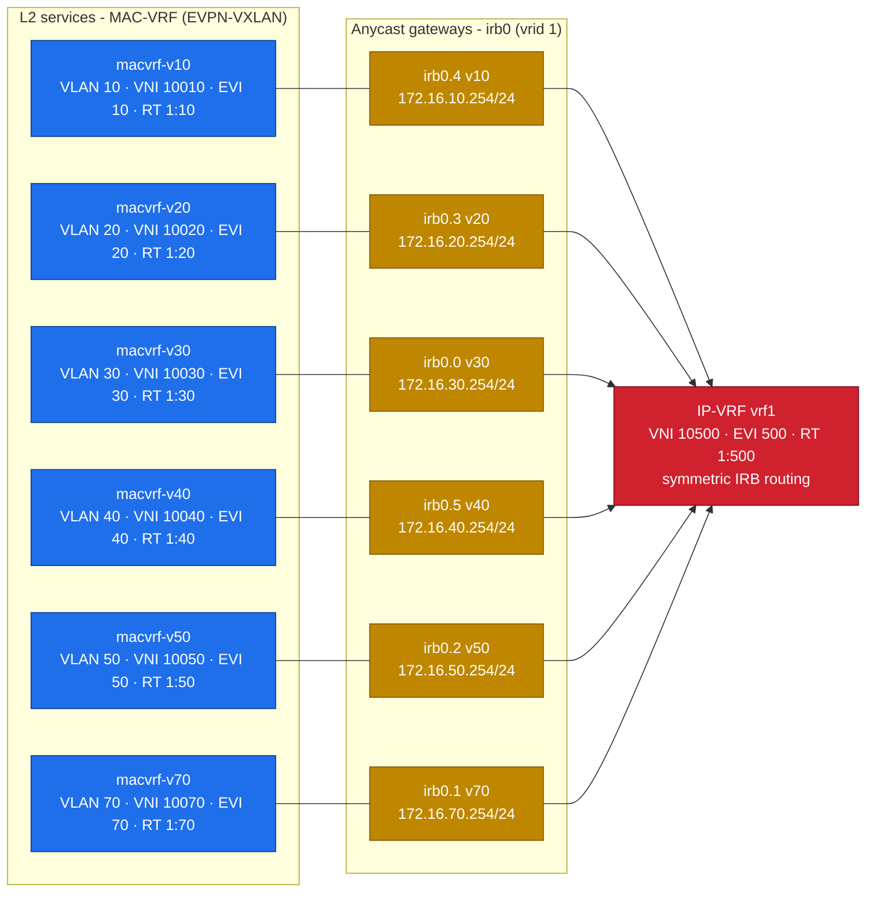
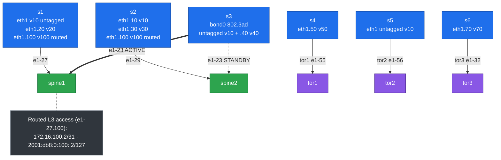
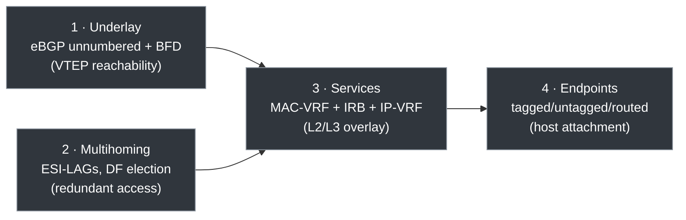

# Collapsed Spine NVD — Topology Diagrams

All values verified against the without-EDA configs
(`collapsed-spine-without-eda/configs/*.cli`).

**Color legend:** green = spine (collapsed spine + border-leaf), purple = ToR
(access-only), blue = Linux host, grey = annotation/metadata.

**The one big idea:** the two spines are an *eBGP underlay* carrying an
*EVPN-VXLAN overlay*. The underlay's only job is to give every spine a reachable
loopback (VTEP). The overlay then builds all L2 and L3 services on top by
exchanging EVPN routes. The four diagrams below follow that exact build order:
**(1) underlay → (2) access/multihoming → (3) services → (4) endpoints.**

## 1 — Underlay / Physical Fabric (eBGP unnumbered + BFD)

**What it does.** Two physical links (`e1-31`, `e1-32`) tie the spines together.
They run **eBGP** (each spine is its own AS: 65501 / 65502) to exchange the
loopback prefixes in `system0` (`192.0.2.2/32`, `192.0.2.1/32`). Those loopbacks
are the **VTEP** addresses every VXLAN tunnel is sourced from.

**Why these are best practices.**

- **eBGP underlay (not OSPF/iBGP):** eBGP is simple, scales horizontally, gives
  loop-free paths by AS-path, and is the IETF/operator-standard underlay for
  EVPN fabrics. One protocol carries both underlay (IPv4/IPv6) and overlay
  (EVPN) address families — fewer moving parts.
- **"Unnumbered" (IPv6 link-local + Router Advertisement):** no need to plan,
  assign, or document a /31 on every fabric link. BGP auto-discovers the
  neighbor over the link-local address. Less config, fewer mistakes, trivial to
  add links.
- **Two parallel ISLs:** ECMP bandwidth *and* redundancy. Either link can fail
  without isolating a spine.
- **BFD:** sub-second failure detection. Without it, BGP would wait tens of
  seconds (hold timer) to notice a dead link; BFD drops that to milliseconds so
  traffic reconverges fast.
- **Single `vxlan0` VTEP per spine:** all services share one tunnel endpoint,
  keeping the data plane simple.

**How it interacts with the rest.** This layer is the *foundation*: the EVPN
routes in diagram 3 are only useful because the underlay here makes the remote
spine's VTEP reachable. No underlay reachability → no overlay.

## 2 — Access & EVPN Multihoming (all-active vs single-active)

**What it does.** Every access device (the three ToRs and host `s3`) connects to
*both* spines as a single logical LAG. EVPN multihoming makes two independent
spines behave like one LACP peer, using a shared **Ethernet Segment Identifier
(ESI)** per bundle. There is **no MLAG peer-link** — the spines coordinate purely
over EVPN BGP.

**The two modes shown (and why both exist):**

- **all-active (tor1/tor2/tor3):** both spine links forward at the same time.
  The host/ToR gets the *sum* of both links' bandwidth and instant failover.
  This is the default best practice for throughput.
- **single-active (s3 / `lag4`):** only one link forwards; the other is held
  **standby** and takes over on failure. Used when the attached device or
  application cannot tolerate receiving the same flow from two paths, or when
  strict active/standby is required. The config proves the harder mode works:
  `preference 800`, `non-revertive` (don't flap back automatically), and
  `standby-signaling-on-non-df` (tell the host via LACP to keep the backup link
  down until needed).

**Why these are best practices.**

- **ESI multihoming over MLAG:** standards-based (RFC 7432), no proprietary
  peer-link to size or fail, and it scales to more than two switches.
- **DF (Designated Forwarder) election:** for each Ethernet Segment, exactly one
  spine is elected to forward BUM (broadcast/unknown/multicast) traffic to the
  host, preventing duplicate frames. **Split-horizon** (via the ESI) stops a
  frame the host sent from looping back to it through the other spine.
- **The host stays dumb:** `s3` runs a *standard* 802.3ad bond and is completely
  unaware two switches are involved — no special host software.

**How it interacts with the rest.** This layer maps **physical ports → logical
LAGs → Ethernet Segments**. Those LAGs are then placed into the L2 services in
diagram 3 (e.g. `lag1.50` lands in `macvrf-v50`). Multihoming is the redundancy
plumbing; the services are what ride on top of it.

## 3 — EVPN Service Stack (L2 MAC-VRF + L3 IP-VRF, on the spines)

**What it does — read it bottom-up as three layers:**

1. **MAC-VRF (L2 broadcast domain):** each VLAN gets its own MAC-VRF bridge
   table, mapped to a **VXLAN VNI** and an **EVI** (EVPN instance). MAC
   addresses learned locally are advertised to the other spine as **EVPN Type-2
   routes**, so a MAC behind one spine is reachable from the other. The **Route
   Target (RT)** controls which VRFs import those routes — it's the "membership
   tag" that keeps tenants/segments separate.
2. **IRB anycast gateway (L2↔L3 boundary):** `irb0.x` gives each VLAN a default
   gateway IP (e.g. `172.16.10.254`). It's an **anycast** gateway — *both* spines
   answer on the same IP and MAC, so a host's default gateway is always one hop
   away regardless of which spine it lands on, and gateway failover is instant.
3. **IP-VRF (L3 routing domain):** `vrf1` routes *between* those VLANs/subnets.
   Inter-subnet traffic is encapsulated to VNI `10500` (**symmetric IRB**), so
   routing scales without every spine needing every other subnet's IRB.

**Why these are best practices.**

- **VLAN→VNI 1:1 mapping with a clear numbering scheme** (VLAN 10 → VNI 10010,
  EVI 10, RT 1:10): predictable, auditable, easy to automate.
- **EVPN control plane (not flood-and-learn VXLAN):** MACs and IP/MAC bindings
  are *advertised* via BGP, not discovered by flooding. Less broadcast, faster
  convergence, built-in ARP/ND suppression and proxy.
- **Anycast gateway:** removes the classic FHRP (VRRP/HSRP) active/standby
  gateway bottleneck — every spine is the gateway simultaneously.
- **Symmetric IRB:** the scalable way to do L3 in EVPN; only the source and
  destination VRFs need the route, not every transit node.

**How it interacts with the rest.** The **LAGs from diagram 2** are the access
ports that get bound into these MAC-VRFs (L2). The **IRBs** bridge those L2
domains up into **`vrf1`** for L3. And all of it is only reachable because the
**underlay in diagram 1** carries the EVPN routes between the spine VTEPs.

## 4 — Endpoint Connectivity (Linux hosts, with edges)

**What it does.** Shows the *five access patterns* the design deliberately
validates with real hosts:

- **L2 untagged** (`s5` eth1 → VLAN 10).
- **L2 tagged** (`s4` eth1.50 → VLAN 50; `s6` eth1.70 → VLAN 70).
- **L3 routed access** (`s1`/`s2` eth1.100 → routed subinterface
  `172.16.100.2/31`, dual-stack).
- **all-active multihoming** (the ToR-attached hosts via diagram 2's ESI-LAGs).
- **single-active multihoming** (`s3` bond0 across both spines).

**Why this matters as a validated design.** A design is only trustworthy if it
proves the *awkward* cases, not just the happy path. By including orphan
single-homed hosts (`s1`/`s2`), a dual-homed bond (`s3`), tagged, untagged, and
routed access all in one lab, every common real-world attachment style is
exercised against the same fabric.

**How it interacts with the rest.** Each host's VLAN here is the *entry point*
into a MAC-VRF in diagram 3, reachable with redundancy via the multihoming in
diagram 2, transported between spines by the underlay in diagram 1. End to end:
**host VLAN → MAC-VRF (L2) → IRB anycast GW → IP-VRF (L3) → VXLAN over eBGP
underlay → remote spine → destination host.**

## How the four layers fit together

- **Underlay** makes VTEPs reachable so the **Services** overlay can exchange
  EVPN routes.
- **Multihoming** provides the redundant access ports that the **Services** bind
  into MAC-VRFs.
- **Services** present L2 domains and L3 gateways that the **Endpoints** plug
  into.
- Remove any lower layer and everything above it stops working — which is why
  the build order (1 → 2 → 3 → 4) is also the right deployment/automation order.

